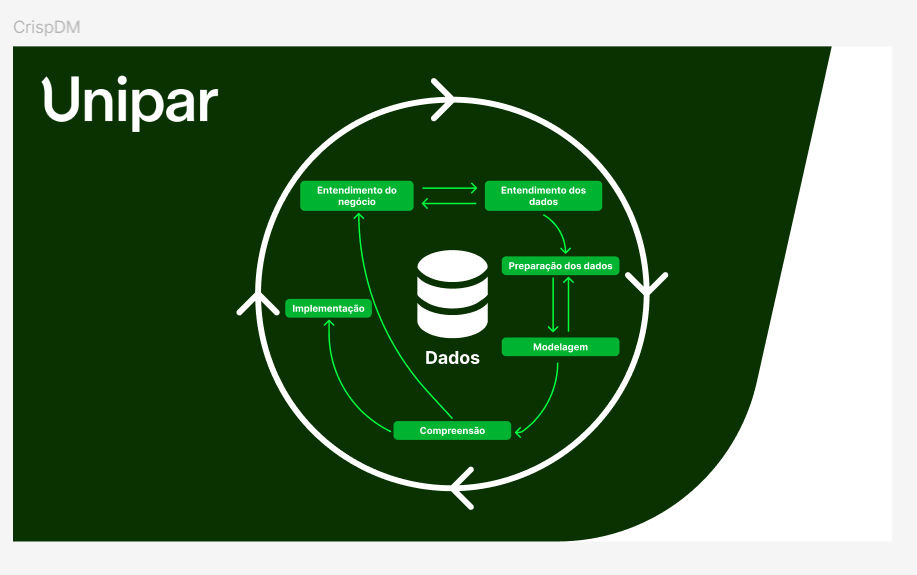
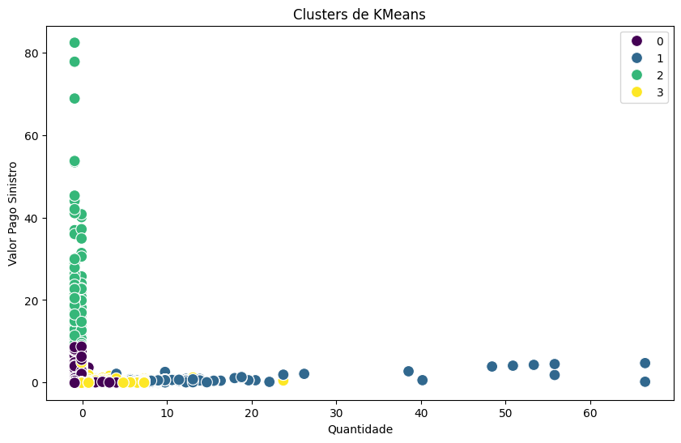

# Documentação Modelo Preditivo - Inteli

## DIPA - DuoImpar Predictive Analysis

### DuoImpar

#### Integrantes
- <a href="https://www.linkedin.com/in/anacdejesus/">Ana Carolina Jesus Pacheco da Silva</a>
- <a href="https://www.linkedin.com/in/anna-riciopo/">Anna Giulia Marques Riciopo</a>
- <a href="https://www.linkedin.com/in/gabriel-scarpelin-diniz-425258144/">Gabriel Scarpelin Diniz</a> 
- <a href="https://www.linkedin.com/in/iasmim-/">Iasmim Santos Silva de Jesus</a> 
- <a href="https://www.linkedin.com/in/pauloheribeiro">Paulo Henrique Ribeiro</a>
- <a href="https://www.linkedin.com/in/pedro-pinheiro-rodrigues-b129b62b7/">Pedro Pinheiro Rodrigues</a> 
- <a href="https://www.linkedin.com/in/kesneylucas/">Kesney Lucas Ferro de Oliveira</a>
- <a href="https://www.linkedin.com/in/yanom%C3%A3/">Yanomã Fernandes Konwski</a>

## Sumário
[1. Introdução](#c1)

[2. Objetivos e Justificativa](#c2)

[3. Metodologia](#c3)

[4. Desenvolvimento e Resultados](#c4)

[5. Conclusões e Recomendações](#c5)

[6. Referências](#c6)

[Anexos](#attachments)


## <a name="c1"></a>1. Introdução

&emsp;Constituída em 1969, a Unipar é uma companhia de grande porte superior com um portfólio internacional e diversificado, atuando principalmente no setor químico e petroquímico da América do Sul. Com uma presença marcante no mercado, a Unipar se destaca como líder na produção de cloro e soda, e é a segunda maior produtora de PVC da região. A empresa possui escritórios em São Paulo e Buenos Aires, e fábricas em Santo André (SP), Cubatão (SP) e Bahía Blanca (Ar) . Além disso, a Unipar está expandindo sua presença com a construção de uma nova planta em Camaçari (BA). Os produtos mais relevantes incluem cloro, soda líquida, ácido clorídrico, hipoclorito de sódio e PVC, essenciais para setores como saneamento, construção civil, têxtil, papel e celulose, desinfetantes, alumínio, brinquedos, sapatos, alimentos, bebidas e farmacêutica. O posicionamento da Unipar no mercado é de grande influência, com poder significativo sobre os preços devido à sua liderança e qualidade reconhecida.

&emsp;A Unipar enfrenta o desafio de analisar o perfil e as necessidades médicas de seus colaboradores para criar programas de saúde otimizados. Atualmente, a empresa precisa de uma análise estruturada e preditiva dos dados de sinistralidade do plano de saúde dos funcionários. Este problema afeta todos os colaboradores, espalhados por suas diversas unidades, e tem impactos primários na eficiência e eficácia dos programas de saúde oferecidos. Impactos secundários incluem possíveis aumentos nos custos operacionais e redução da satisfação e produtividade dos colaboradores devido a programas de saúde inadequados. Assim, esse desafio requer uma compreensão aprofundada e personalizada das necessidades de saúde dos funcionários, visando a promoção de um ambiente de trabalho mais saudável e produtivo.

## <a name="c2"></a>2. Objetivos e Justificativa
### 2.1 Objetivos

&emsp;De acordo com [Amanda Tracera (2022)](#TRACERA) os objetivos gerais são amplos e descrevem os resultados de longo prazo que uma organização deseja alcançar. Eles fornecem uma visão geral do que a organização pretende realizar. Já os objetivos específicos são mais detalhados e concretos, descrevendo as ações e etapas necessárias para atingir os objetivos gerais. Eles são mensuráveis e limitados no tempo, proporcionando uma orientação clara sobre como os objetivos gerais serão alcançados.

#### 2.1.1 Objetivos Gerais e Específicos da Unipar

1. **Específico: Criar modelos de previsão e tendências com base em comportamento relacionado a sinistralidade (utilização) do plano de saúde**

   - Analisar dados históricos de sinistralidade e identificar padrões de utilização.
   - Desenvolver algoritmos de previsão que avaliem a correlação dos dados que seguem padrões previamente identificados.
   - Verificar causalidade dos dados correlatos.
   - Integrar os modelos preditivos com os sistemas de gestão de pessoas da Unipar.

2. **Específico: Encontrar indicadores para maneiras de aprimorar os programas de saúde para que haja personalização no programa de saúde ofertado**

   - Realizar análises de cluster para segmentar a população de colaboradores com base em características de saúde.
   - Identificar indicadores-chave de saúde (ex.: doenças crônicas, hábitos de vida) que possam orientar a personalização.

3. **Geral: Gerar valor sem perder a escalabilidade do atual plano de saúde**

   - Analisar o custo-benefício dos atuais programas de saúde e identificar áreas de melhoria.
   - Monitorar e ajustar os programas para garantir que eles continuem escaláveis à medida que a empresa cresce.
   - Desenvolver modelos de previsão que ajudem a antecipar as necessidades de saúde dos colaboradores e a adaptar os programas de saúde de acordo.

4. **Específico: Avaliar maneiras de mensurar a percepção de valor dos colaboradores em relação às iniciativas propostas**

   - Desenvolver e aplicar pesquisas de satisfação regulares com os colaboradores.
   - Analisar feedback qualitativo e quantitativo para identificar áreas de melhoria.
   - Realizar grupos focais e entrevistas para obter insights mais profundos sobre a percepção dos colaboradores.
   - Ajustar os modelos com base nos resultados das avaliações e feedbacks coletados.

5. **Específico: Investigar diferentes modelos de previsão e tendências comportamentais de acordo com os dados captados dos colaboradores**

   - Comparar diferentes modelos de previsão e tendências comportamentais.
   - Analisar a eficácia de modelos supervisionados, não-supervisionados e mistos para diferentes tipos de dados.
   - Validar os modelos com dados providos e ajustá-los conforme necessário.
   - Desenvolver relatórios e visualizações que ajudam a interpretar os resultados dos modelos preditivos e tendências comportamentais.

6. **Geral: Aumentar a qualidade de vida e bem estar do colaborador**

   - Desenvolver programas personalizados para segmentos de colaboradores com base em semelhanças em sua saúde.
   - Auxiliar o colaborador a cuidar de sua saúde oferecendo programas que se relacionem com seu perfil.

&emsp;A diferenciação entre objetivos gerais e específicos, conforme apresentado no planejamento, demonstra uma abordagem estruturada para a gestão da saúde dos colaboradores. Os objetivos gerais, como o aumento da qualidade de vida e a manutenção da escalabilidade, demonstram a finalidade das iniciativas da empresa. Por outro lado, os objetivos específicos detalham formas precisas de se atingir essas metas, como a criação de modelos preditivos, personalização de programas de saúde e a avaliação contínua da percepção de valor pelos colaboradores. Esta abordagem não só garante a implementação efetiva das estratégias, mas também possibilita ajustes no projeto baseados em evidências. A implementação desses objetivos permitirá a Unipar a otimizar seus recursos destinados a saúde e a sustentabilidade dos seus programas além disso, reforça seu compromisso com a saúde e o bem-estar de seus colaboradores.

### 2.2 Proposta de solução

&emsp;A solução proposta pela DuoImpar para a Unipar envolve a construção de um modelo preditivo não-supervisionado. Este modelo visa atender os objetivos da Unipar relacionados a identificações de perfis de usuários que estão na sua base de ativação de sinistro, para que desta forma proponham programas de saúde mais abrangentes e que representam as necessidades de suma maioria de seus colaboradores, além de aumentar a percepção de valor quanto a estes programas.

&emsp;O modelo não-supervisionado será responsável pela identificação das principais variáveis no conjunto de dados fornecido. Esse processo inclui a análise de correlações entre diferentes variáveis para identificar padrões e agrupamentos (clusters) dentro dos dados. Os clusters ajudarão a segmentar os assegurados do plano de saúde em grupos com características e necessidades similares, facilitando a personalização dos programas de saúde.

&emsp;Dessa forma, a proposta da DuoImpar atende aos objetivos da Unipar, proporcionando uma solução que busca melhorar a gestão da saúde dos colaboradores e otimiza os recursos disponíveis.

### 2.3 Justificativa

&emsp;A Unipar está comprometida em promover o bem-estar e a saúde de seus colaboradores, garantindo que eles tenham acesso a programas de saúde que realmente atendam às suas necessidades específicas. Em um ambiente corporativo competitivo e dinâmico, onde a eficiência e o cuidado com o capital humano são fundamentais para o sucesso e a sustentabilidade da empresa, é crucial adotar abordagens que permitam uma gestão proativa da saúde dos colaboradores.

&emsp;A implementação de um modelo preditivo se torna necessária para que a Unipar possa antecipar comportamentos e tendências relacionadas à utilização dos serviços de saúde. Com isso, a empresa poderá desenvolver programas de saúde mais direcionados e eficazes, alinhados ao perfil e às necessidades reais dos colaboradores. Isso não apenas otimiza os recursos e investimentos em saúde, mas também reforça o compromisso da Unipar com a sustentabilidade, a responsabilidade social e a confiança em todas as suas relações.

&emsp;A adoção dessa solução preditiva permitirá à Unipar manter-se à frente no cuidado com seus colaboradores, garantindo que as ações tomadas sejam embasadas em dados concretos e tendências observáveis, o que resulta em programas de saúde mais personalizados e, consequentemente, em maior satisfação e produtividade dos colaboradores.

## <a name="c3"></a>3. Metodologia

&emsp;A metodologia CRISP-DM (_Cross-Industry Standard Process for Data Mining_) é amplamente reconhecida e adotada em projetos de mineração de dados, análise e ciência de dados. De acordo com [Souza (2023)](https://medium.com/blog-do-zouza/metodologia-crisp-dm-uma-abordagem-abrangente-para-projetos-de-dados-d7e7135b907e), a Mineração de Dados (ou _Data Mining_) refere-se a um processo analítico sistemático de exploração e processamento de grandes conjuntos de dados para extrair informações úteis e insights. O principal objetivo da CRISP-DM nesse projeto é desenvolver modelos preditivos a partir da análise desses dados, visando antecipar problemas, otimizar processos e sugerir soluções eficazes. [Silva (2016)](#SILVA) ressalta que a metodologia CRISP-DM é estruturada em seis fases fundamentais que orientam os analistas ao longo do processo de descoberta de conhecimento a partir dos dados: </br>

1. **Compreensão do negócio (_Business Understanding_)**: Nesta fase inicial, o foco é entender profundamente o contexto do negócio e seus objetivos específicos. Isso envolve identificar quais são as questões críticas para o negócio que precisam ser respondidas e como a análise de dados pode contribuir para alcançar os objetivos estratégicos. É uma fase de definição do escopo e estabelecimento de metas claras para o projeto de mineração de dados.

2. **Compreensão dos dados (_Data Understanding_)**: Depois de definir os objetivos do negócio, o próximo passo é coletar dados relevantes e entender suas características. Essa fase envolve a exploração inicial dos dados, a identificação de possíveis problemas como dados ausentes ou valores discrepantes, e a avaliação da qualidade dos dados. O objetivo é garantir que os dados sejam adequados e suficientes para apoiar as necessidades do projeto.

3. **Preparação dos Dados (_Data Preparation_)**: Envolve a transformação dos dados brutos em um formato adequado para a modelagem. Isso inclui tarefas como limpeza de dados, tratamento de valores ausentes ou outliers, integração de diferentes fontes de dados, e a seleção de atributos relevantes. A preparação adequada dos dados garante que os modelos construídos sejam precisos e confiáveis.

4. **Modelagem (_Modeling_)**:  Com os dados preparados, a fase de modelagem envolve a aplicação de técnicas analíticas e algoritmos para criar modelos preditivos ou descritivos. Dependendo dos objetivos do projeto, diferentes métodos de modelagem podem ser utilizados, como regressão, classificação, agrupamento, entre outros. Durante esta fase, é comum ajustar os parâmetros dos modelos para otimizar seu desempenho.

5. **Avaliação (_Evaluation_)**: Após a construção dos modelos, é essencial avaliar sua eficácia e precisão. Esta fase utiliza técnicas de validação cruzada, análise de métricas de desempenho (como acurácia, precisão, recall, etc.) e revisões qualitativas para garantir que os modelos realmente atendam aos objetivos de negócio estabelecidos. Caso necessário, refinamentos adicionais podem ser feitos para melhorar os resultados.

6. **Implantação (_Deployment_)**:  A fase final envolve a implementação prática dos modelos em um ambiente de produção. Isso pode significar a integração dos modelos em sistemas existentes, a criação de dashboards ou relatórios que possam ser utilizados pela equipe de negócios para a tomada de decisões. Além disso, inclui o monitoramento contínuo do desempenho do modelo e a adaptação a novos dados para manter sua relevância e precisão ao longo do tempo.

<div align="center">
<sub>Figura 1 — Metodologia CRISP-DM</sub>

<sup>Fonte: Material produzido pelos autores (2024)</sup>
</div></br>


&emsp;Em suma, a metodologia CRISP-DM oferece uma abordagem estruturada e flexível para a execução de projetos de mineração de dados. Um dos seus grandes diferenciais é a flexibilidade, pois as fases não seguem uma ordem rígida e podem ser revisitadas conforme necessário. Isso permite que ajustes sejam feitos ao longo do projeto, garantindo que novas descobertas ou desafios sejam incorporados ao processo sem comprometer o resultado final. Ao seguir as seis fases principais — desde a compreensão do contexto empresarial até a implantação dos modelos preditivos —, as organizações podem extrair valor significativo de seus dados e utilizá-los para tomar decisões informadas, tornando o CRISP-DM uma ferramenta essencial para o sucesso em ambientes de negócios cada vez mais orientados por dados.

## <a name="c4"></a>4. Desenvolvimento e Resultados
### 4.1. Compreensão do Problema
#### 4.1.1. Contexto da indústria

&emsp;Em primeira análise, a indústria química desempenha um papel vital na criação de produtos essenciais para a sociedade e o avanço tecnológico. Dentre os principais produtos originados dessa indústria listam-se: produtos farmacêuticos, plásticos, fertilizantes, solventes, e químicos de base, produtos esses que compõem uma significativa parte dos itens mais utilizados no cotidiano. Ademais, o crescimento constante da indústria química indica uma crescente necessidade de insumos, mostrando que este é um mercado que move bilhões e é esencial para o cenário global. </br>

&emsp;No contexto brasileiro, a indústria química é composta por diversos _players_ - os players de mercado são empresas que atuam em setores específicos, sendo participantes ativos e que competem entre eles. (“Você sabe o que são players de mercado?”, 2023)- e faturou mais de US$167,4 bilhões líquidos em 2022, contribuindo com 3% do PIB brasileiro em 2023 [(BROADCAST, 2023)](#BROADCAST). Outros players importantes nessa dinâmica nacional incluem o Estado, que, segundo a Lei 9.478/97 Art. 21 [(L9478, 1997)](#L9478), detém direitos de exploração e produção de petróleo e gás natural, configurando-se como um grande player através da Petrobrás, especialmente na produção de insumos dependentes do petróleo. </br>

&emsp;Em escala global, a América Latina conta com _players_ significativos como Braskem, Solvay Indupa e  a CQN, que impactam o mercado global através de suas operações extensivas e influências no setor químico. A Unipar é líder na produção de cloro e soda na América Latina, competindo com outras companhias como a Braskem e a CQN. Já no setor de resinas termoplásticas (PE, PP e PVC), a Braskem é a maior produtora, seguida pela Unipar e, por fim, a companhia Solvay Indupa. A integração de modelos preditivos em suas operações pode ampliar ainda mais seu alcance e eficácia, reforçando a importância desses players no cenário mundial. </br>

&emsp;De acordo com [Neil Patel (2019)](#PATEL), os principais modelos de negócios na indústria química sul-americana incluem B2B (business-to-business), B2G (business-to-government), G2B (government-to-business) e, em alguns casos, B2C (business-to-consumer). Quando a Unipar compra insumos de empresas estatais, como a Petrobras, a transação ocorre no modelo B2B (business-to-business), pois, apesar de serem de propriedade do governo, essas empresas operam como entidades comerciais. Da mesma forma, quando a Unipar vende seus insumos químicos a outras empresas, ela está operando no modelo B2B, fornecendo produtos essenciais para os processos produtivos de outras organizações. A maior parte do modelo de negócios da Unipar é B2B, refletindo sua dinâmica comercial tanto na aquisição de matérias-primas quanto na distribuição de seus produtos no mercado. </br>

&emsp;Conforme a renomada revista ["The Economist" (2017)](#THEECONOMIST), dados são considerados valiosos recursos, superando até mesmo o petróleo em importância. Em vista disso, modelos preditivos que permitem a análise de grandes volumes de dados para prever tendências e comportamentos trazem inovação e eficiência para empresas, sendo um diferencial no mercado atual. Nesse enfoque, modelos preditivos auxiliam empresas a diminuir gastos e aumentar lucros, promovendo desenvolvimento humano e empresarial ao proporcionar insights valiosos que orientam a tomada de decisões estratégicas. </br>


&emsp;De acordo com Porter, o modelo de 5 forças analisa a competitividade de um setor, destacando as ameaças dos concorrentes, o poder dos fornecedores e compradores, bem como as ameaças de novos entrantes e produtos substitutos. Essa abordagem visa proporcionar uma compreensão aprofundada do ambiente mercadológico em que a empresa opera [(MAGRETTA, 2019)](#MAGRETTA).

&emsp;Na Figura 2, observa-se as 5 Forças de Porter no contexto da indústria química sul-americana.

<div align="center">
<sub>Figura 2 — 5 Forças de Porter</sub>

<sup>Fonte: Material produzido pelos autores (2024)</sup>
</div></br>

1. *Concorrência entre Empresas (Rivalidade Competitiva)*

   - A indústria química é altamente competitiva, com players como Braskem, Solvay Indupa e CQN dominando o mercado. A Unipar se posiciona como um player relevante na América do Sul, com forte presença no Brasil e na Argentina, competindo por market share e inovação tecnológica.

2. *Ameaça de Novos Entrantes*

   - A barreira de entrada na indústria química é alta, devido ao elevado capital necessário para investimentos em infraestrutura e pesquisa. No entanto, empresas inovadoras que utilizam modelos preditivos para otimização de processos podem encontrar nichos para inserção, desafiando os players estabelecidos. Fatores como regulação e acesso a matérias-primas também influenciam a entrada de novos competidores.

3. *Poder de Barganha dos Fornecedores*

   - Fornecedores de matérias-primas como petróleo e gás natural, controlados em parte pelo Estado através da Petrobrás, possuem alto poder de barganha, impactando os custos operacionais das empresas químicas.

4. *Poder de Barganha dos Clientes*

   - Grandes clientes, especialmente na compra de insumos em modelos B2B, possuem significativo poder de barganha devido à capacidade de negociação de contratos em larga escala, pressionando por preços competitivos e qualidade.

5. *Ameaça de Produtos Substitutos*
   - A inovação tecnológica e o desenvolvimento de novos materiais podem representar uma ameaça de substituição para produtos tradicionais da indústria química. Modelos preditivos podem auxiliar empresas como a Unipar a continuarem se adaptando e seguindo as mudanças de mercado, desenvolvendo um nível de qualidade que atenda às demandas emergentes.

&emsp;Nessa perspectiva, é notório que a indústria química, em principal para os grandes players, é distinta pela sua alta competitividade que qualifica um intenso oceano vermelho. Nesse tipo de ambiente, em que os poderes de barganha são altos e a concorrência não deixa a desejar, de acordo com Clayton Christensen(1997), apenas a constante inovação desruptiva proporcionada pela tecnologia pode trazer segurança e prosperidade para um competidor. Assim, por meio de tecnologias como modelos de predição é possível criar um diferencial que não só atende o requisito de escalabilidade, mas também garante maior acuidade nas decisões corporativas e indicadores que podem oferecer novas perspectivas de negócios.

#### 4.1.2. Análise SWOT

&emsp;A análise SWOT, ou FOFA, é uma ferramenta que estuda os aspectos internos e externos de uma empresa, proporcionando uma visão abrangente do projeto em questão. Por meio dela, são identificadas as forças, fraquezas, oportunidades e ameaças, possibilitando uma avaliação do ambiente interno e externo da empresa, como representado na Figura 3.[(FERNANDES, 2015)](#FERNANDES).

<div align="center">
<sub>Figura 3 — Análise SWOT</sub>

<sup>Fonte: Material produzido pelos autores (2024)</sup>
</div>

##### Forças:
- **Portfólio extenso e diversificado:** A oferta de uma ampla gama de produtos possibilita a presença da Unipar no fornecimento de matéria prima para diversas indústrias [(ABIQUIM, s.d.)](#ABIQUIM).

- **Inovação e expansão processos internos:** Além de ter um portfólio extenso no setor químico e petroquímico, a Unipar também extende sua área de atuação para novos setores, como o elétrico, exemplificado por meio de projetos como o complexo eólico Tucano em Cubatão [(Brazil Journal, 2023)](#JBrazilJournal).

- **Prestígio internacional:** Além de ser creditada como uma das maiores companhias da industria química da américa do sul, a Unipar também tem certificações internacionais de gestão e comprometimento ambiental como ISO 9001, ISO 14001, ISO 45001, HALAL e KOSHER [(BJÖRKLUND, 2024)](#BJORKLUND).

- **Conexão com as comunidades locais:** Por meio de projetos como o Programa Fábrica Aberta, Projeto Jardim Planteucal e Projeto Jardim Encantado, a Unipar estabelece uma forte conexão com as comunidades adjacentes. Nesse esforço, a empresa se mostra congruente com sua missão de gerar valor com sustentabilidade e aumentar a qualidade de vida.

- **Reputação e confiança:** Com mais de 50 anos de atuação e sendo uma das maiores produtoras de Cloro, soda e PVC na América do Sul, a Unipar tem uma presença de mercado que fortalece o seu desenvolvimento e a criação de novas parceria.

##### Fraquezas:
- **Alta dependência de recursos naturais:** Dependência significativa de matérias-primas, pode causar vulnerabilidade a flutuações de preços e disponibilidade.

- **Complexidade regulatória:** Navegação por diferentes regulações ambientais e de segurança em diversos países pode ser desafiadora e custosa.

- **Capacidade limitada de diversificação geográfica:** Por ter o foco principal no Brasil e Argentina, o potencial de crescimento em outras regiões não é aproveitado.

- **Custo operacional:** Manter operações em múltiplos locais (diversas regiões do Brasil e na Argentina) com altos padrões de segurança e sustentabilidade pode resultar em custos elevados.

##### Oportunidades:
- **Créditos de Carbono:** Participação em mercados de carbono pode gerar novas fontes de receita e reforçar imagem sustentável. Com projetos como o Tucano, Cajuína e Lar do Sol, a produção de energia renovável praticada pela Unipar pode gerar créditos de carbono que, posteriormente, podem ser convertidos em receita adicional.

- **Ampliação do comprometimento com a responsabilidade socioecológica:** Investimentos em projetos de sustentabilidade e responsabilidade social podem fortalecer a marca e atrair novos clientes. Ademais, de acordo com a jornalista [Maíra Rubim (2024)](#RUBIM) investir em projetos sustentáveis é um diferencial de mercado indispensável na atualidade.

- **Expansão em novos mercados:** Entrada em novos países e mercados pode aumentar a base de clientes e diversificar riscos.

- **Parcerias para desenvolvimento tecnológico:** Colaborações com outras empresas e instituições podem trazer inovações tecnológicas e abrir novas oportunidades de negócios. Um exemplo de tipo de empresas disruptivas que convergem com o compromisso da Unipar de desenvolver tanto os seus produtos quanto a sua comunidade são as Tech Houses que operam no modelo que oferta Softwares como serviço (SaaS). Com a utilização de softwares especializados a Unipar pode se beneficiar de ter um processo de produção mais ágil e personalizado.

##### Ameaças:
- **Volatilidade de mercado:** Flutuações nos preços das matérias-primas e demanda dos produtos podem impactar a receita.

- **Políticas econômicas:** Tendo em vista que o principal fornecedor de matéria-prima para a indústria petroquímica nas regiões de atuação da Unipar (Brasil e Argentina) são as empresas petrolíferas estatais Petrobrás e YPF que controlam, respectivamente, 98% [(ELIAS, 2021)](#ELIAS) e 60% [(INFOBAE, 2022)](#INFOBAE) da produção de petróleo dos seus países, a Unipar se encontra em uma situação de dependêndia em relação a elas. Essa instância se confere na própria constituição brasileira por meio da [Lei 9.478 Art. 21. (1997)](#L9478), em paralelo, movimentos econômicos de controle da inflação como os pela Argentina durante as últimas décadas [(SOLANAS; MARTÍNEZ, 2019)](#SOLANAS). Portanto, o controle ostensivo de recursos naturais praticado por esses países representam uma grande ameaça para empresas do setor químico e petroquímo como a Unipar, uma vez que mudanças nas políticas econômicas e regulamentações podem afetar diretamente a operação e lucratividade.

- **Concorrência Intensa:** Competição acirrada no setor químico pode pressionar as margens de lucro. Sempre que há alguma disrupção no setor que propõe estabilidade unilateral para um competidor no oceano vermelho, torna-se prioridade para os outros competidores nivelar os diferenciais.

- **Suscetibilidade à impactos ambientais:** Riscos de desastres ambientais podem resultar em custos elevados e danos à reputação, principalmente em indústrias como a química que tem alto potencial de dano ao meio ambiente.

&emsp;Portanto, levando em conta o contexto do ambiente interno (Forças e Fraquezas), juntamente com o ambiente externo (Oportunidades e Ameaças) da análise SWOT apresentada, denota-se que a UNIPAR possui diversos diferenciais em razão do seu modelo de negócio e operação. Todavia, em uma indústria que é marcada por constantes mudanças, faz-se necessário acompanhar esse desenvolvimento com melhorias tecnológicas para que continuem assegurando a competitividade da Unipar no mercado.

#### 4.1.3. Planejamento Geral da Solução

&emsp;Neste projeto, estamos utilizando o banco de dados de RH da Unipar. Contamos com relatórios fornecidos pela Corretora de Saúde (Mercer Marsh Benefícios), que incluem dados anonimizados sobre a utilização do plano de saúde pelos colaboradores, destacando utilizadores, hospitais, procedimentos mais frequentes, entre outros.

&emsp;As bases de dados são, em sua maioria, extraídas do SAP e servem como insumos para análise e correlação das informações, juntamente com os dados fornecidos pela Corretora de Saúde (Mercer Marsh Benefícios – Apólice Bradesco).

&emsp;A solução proposta pela DuoImpar para a Unipar envolve a construção de um modelo preditivo não-supervisionadas. Este modelo tem como objetivo atender às necessidades da Unipar, otimizando e personalizando os programas de saúde dos colaboradores, além de prever tendências de utilização dos planos de saúde.

&emsp;O modelo não-supervisionado analisará correlações entre diferentes variáveis para identificar padrões e formar agrupamentos (_clusters_) dentro dos dados. Estes que serão fundamentais para a identificação dos perfis nos diferentes agrupamentos. 

&emsp;A solução baseada em análise preditiva proposta por nossa equipe pode ser utilizada de muitas formas pela empresa como base para a criação de novos programas de saúde, a personalização de programas e o mapeamento de riscos. Dessa forma, a gestão baseada na solução permite uma resposta eficaz às necessidades de saúde de seus colaboradores e visa melhorar continuamente as iniciativas de bem-estar da empresa. </br>

&emsp;Primeiramente, a gestão pode se basear nos _insights_ obtidos com o modelo preditivo para criar programas de saúde direcionados, garantindo a personalização dos programas para atender a diferentes grupos de colaboradores, mantendo a escalablidade e eficiência. Ademais, a corporação pode desenvolver um mapa de risco, baseado em padrões de sinistralidade, para priorizar intervenções com base na gravidade e na frequência de problemas de saúde dos funcionários. Desse modo, a iniciativa proporciona uma visão abrangente e preventiva das necessidades de saúde dos colaboradores, além de apoiar a empresa em sua estratégia de responsabilidade social e em seu compromisso com o bem-estar dos funcionários. </br>

&emsp;Para avaliar o êxito do modelo proposto para a Unipar, foram utilizados **critérios de sucesso**, que definem metas a serem atingidas para que o modelo funcione como o esperado. Os critérios de sucesso desenvolvidos pela equipe podem ser observados abaixo: </br>

* **Precisão das previsões**:  O modelo deve ser capaz de prever com precisão os padrões de sinistralidade e comportamentos de uso dos planos de saúde dos colaboradores.

* **Identificação dos grupos de risco**: A análise deve identificar corretamente os grupos de colaboradores com necessidades específicas, permitindo a criação de programas de saúde direcionados.

* **Adaptabilidade e Escalabilidade**: O modelo deve ser capaz de fornecer percepções para a criação de programas adaptados a diferentes grupos de colaboradores, porém mantendo a escalabilidade.

&emsp;Além dos critérios de sucesso, foram definidas **métricas de avaliação**, permitindo a quantificação do desempenho do modelo por meio de funções matemáticas que avaliam a capacidade de erro e acerto do modelo, que podem ser observadas abaixo: </br>

1. **Métricas de performance**: </br>
* **Acurácia**: Mede a proporção de previsões corretas feitas pelo modelo.
* **Precisão**: Avalia a proporção de previsões positivas corretas em relação ao total de previsões positivas.
* **Recall**: Mede a capacidade do modelo de identificar corretamente todos os casos positivos.
* **F1-Score**: Equilíbrio entre precisão e recall, útil quando há um desequilíbrio entre as classes.

2. **Métricas de Agrupamento (Modelos Não Supervisionados)**: </br>
* **Índice de Silhueta**: Mede a coesão e separação dos clusters formados.
* **Coerência dos Clusters**: Avalia se os colaboradores dentro do mesmo cluster têm características e necessidades similares.
</br>


&emsp;Em síntese, foram desenvolvidos critérios de sucesso para o nosso modelo de acordo com o que foi proposto pela empresa parceira e suas expectativas em relação ao projeto, e foram escolhidas métricas de avaliação que proporcionam, matematicamente, uma perspectiva do desempenho do modelo. Portanto, critérios de sucesso e métricas de avaliação são fundamentais para garantir que modelos preditivos sejam não apenas tecnicamente competentes, mas também relevantes e produtivos para o negócio ou aplicação a que se destinam.

#### 4.1.4. Value Proposition Canvas
&emsp;De acordo com o redator Kellison Ferreira (s. d.), o Value proposition canvas, ou canvas de proposta de valor, é uma ferramenta de análise de público consumidor. Vale ressaltar que essa ferramenta é dividida em dois blocos - o Mapa de Valor e o Perfil do Cliente - que permitem uma clara compreensão do segmento dos clientes, que incluem suas dores, ganhos desejados e suas tarefas, os quais o cliente faz hoje sem a solução. Além disso, a ferramenta apresenta a forma como os produtos ou serviços oferecidos aliviam as dores apresentadas pelos clientes, gerando ganhos a todas as partes beneficiadas - a empresa e seus clientes -. Esse procedimento estruturado facilita o entendimento das necessidades do cliente com a solução que lhe é oferecida, resultando em uma proposta de valor que aborda de forma ampla uma solução, que resolve os problemas levantados a partir da análise do segmento do cliente. Após a apresentação do conceito do canvas de proposta de valor e sua aplicação, o template foi preenchido com as informações mostradas na imagem abaixo:

<div align="center">
<sub>Figura 4 - Canvas proposta de valor </sub>

<sup>Fonte: Material produzido pelos autores (2024)</sup>
</div>

&emsp;A partir da imagem é possível visualizar que a Unipar, empresa para qual a solução é voltada, realiza diariamente tarefas relacionadas à análise dos dados de sinistro de convênio médico. Com estas informações, criam programas de saúde que melhor se adequam às necessidades dos colaboradores. Todas essas tarefas são feitas de forma manual, sem terem dados estatísticos como base para as tomadas de decisões. Dessa forma, aumenta a dificuldade em definir um perfil para os grupos de colaboradores e qual programa mais se adequa a eles. Em decorrência disso, a empresa fomenta ganhos como a possibilidade de gastar menos com programas médicos e ter programas que se adequam aos grupos de colaboradores e, consequentemente, gerando qualidade de vida e bem estar a eles.


&emsp;Após a análise do segmento do cliente, é preciso ressaltar os criadores de valor que serão oferecidos à empresa, os quais são voltados para a redução de gastos e aumento da assertividade. Esses criadores baseiam-se em dados analisados pelo modelo preditivo criado, além da análise de dados que auxilia o RH a encontrar o programa de saúde ideal.

&emsp; Outro ponto relevante é que, a partir das dores identificadas, foram propostos os analgésicos para aliviar essas dores, como uma interface intuitiva que apresenta de forma clara todas as análises realizadas pelo modelo preditivo, além de velocidade e eficiência no processo de análise, com informações relevantes e indicação de programas adequados ao grupo perfis analisado pelo modelo preditivo. Com todos esses tópicos do segmento do cliente em mente, é possível reunir as informações apresentadas e propor os produtos e serviços a serem oferecidos, que incluem um modelo de _machine learning_ não-supervisionado e uma plataforma visual que facilita o acesso e entendimento do modelo.


#### 4.1.5. Matriz de Riscos


   &emsp;Para o desenvolvimento eficaz de um projeto, é essencial a elaboração de uma Matriz de Riscos. Essa ferramenta proporciona uma análise completa do que pode impactar o projeto de forma negativa e positiva, isto é, ameaças e oportunidades, respectivamente.

   &emsp;O modelo a ser seguido conta com colunas, que indicam o impacto que determinado risco pode ter no projeto, e linhas, que estimam a probabilidade desse risco acontecer. Assim, cada item proposto é colocado em uma lacuna, a qual pode ter a cor verde, amarela ou vermelha, cada uma tendo um significado dependendo se é uma ameaça ou uma oportunidade. Entretanto, em ambos os casos devem receber mais atenção aqueles tópicos mais próximos do canto superior direito, ou seja, com probabilidade e impacto alto.

   &emsp;Seguindo essa analogia, a seguir há a Matriz de Riscos voltada para ameaças:

   <div align="center">
   <sub>Figura 5 - Matriz de Riscos - Ameaças </sub>
   
   <sup>Fonte: Material produzido pelos autores (2024)</sup>
   </div>

   1. **Assertividade baixa**
      - Ameaça: Concluir o projeto com uma taxa de assertividade baixa, ou seja, o modelo preditivo não garantir resultados precisos.
      - Impacto (Moderado): Com uma baixa assertividade, podem ser feitas previsões falhas.
      - Probabilidade (Moderada): Considerando a base de dados disponibilizada, há uma probabilidade considerável dos dados serem escassos para o desenvolvimento de um modelo preditivo com alta taxa de assertividade
      - Mitigação: Realizar uma modelagem de dados eficiente e, caso necessário, coletar dados adicionais é decisivo para alcançar uma alta taxa de assertividade.

   2. **Incongruência correlação-causalidade**
      - Ameaça: A associação de duas variáveis que possuem correlação, porém não apresentam causalidade.
      - Impacto (Grande): Com a associação enganosa de variáveis, podem ser feitas previsões imprecisas ou até mesmo erradas.
      - Probabilidade (Moderada): Por se tratar de dados relacionados a um assunto pouco conhecido pelo grupo, há uma probabilidade considerável de enganos.
      - Mitigação: Avaliar regularmente a percepção de valor dos colaboradores e ajustar os programas de saúde de acordo pode aumentar a eficácia e aceitação das iniciativas.

   3. **Modelagem errada dos dados**
      - Ameaça: Modelagem errada dos dados, isto é, a escolha inadequada dos algoritmos.
      - Impacto (Grande): Esse erro pode causar previsões imprecisas, diminuindo a efetividade do modelo.
      - Probabilidade (Moderada): Pela inexperiência da maior parte dos integrantes quando se trata de modelos preditivos, há uma probabilidade significativa de haver uma modelagem errada dos dados.
      - Mitigação: Realizar validações cruzadas e testes com diferentes modelos é crucial.

   4. **Problemas de comunicação**
      - Ameaça: Não manter uma boa comunicação com o parceiro e, consequentemente, desenvolver um projeto fora do esperado.
      - Impacto (Grandíssimo): Com um mau entendimento da proposta, o projeto pode não atender as espectativas do parceiro, não cumprindo os objetivos.
      - Probabilidade (Moderada): Considerando os poucos momentos de contato com o parceiro, há uma probabilidade considerável de ocorrerem enganos.
      - Mitigação: Elaborar perguntas com frequência para esclarecer dúvidas é essencial para manter as ideias alinhadas com o parceiro.

   5. **Dados insuficientes**
      - Ameaça: Os dados disponibilizados pelo parceiro serem insuficientes para análises e previsões efetivas.
      - Impacto (Grandíssimo): A falta de dados resulta em uma baixa precisão das previsões, já que afeta a identificação de padrões, correlações e tendências futuras.
      - Probabilidade (Moderada): Considerando o domínio do parceiro sobre os dados necessários e, consequentemente, a falta de controle do grupo, eleva a probabilidade.
      - Mitigação: É ideal coletar dados adicionais e integrar múltiplas fontes de dados de maneira a melhorar o modelo, evitando enviesamentos e, por conseguinte, mitigar esse risco.

   6. **Dados não-tratados**
      - Ameaça: O tratamento ineficiente dos dados pode levar a erros nas análises.
      - Impacto (Grande): O não-tratamento dos dados pode acarretar previsões falhas e ineficientes.
      - Probabilidade (Pouco Provável): Ao ter esse risco pontuado, o grupo terá um cuidado maior ao tratar dados.
      - Mitigação: Para mitigar esse risco vale considerar a implementação de processos rigorosos de ETL (Extract, Transform, Load) e garantir a conformidade com a LGPD (Lei Geral de Proteção de Dados).

   7. **Falta de escalabilidade**
      - Ameaça: O desenvolvimento de modelos que não suportam crescimento.
      - Impacto (Grande): A falta de escalabilidade pode restringir a aplicação dos resultados.
      - Probabilidade (Pouco Provável): A partir do momento em que foi pontuado um risco que pode ser mitigado caso sejam tomadas atitudes desde o início do projeto, a probabilidade de que ele se concretize é reduzida.
      - Mitigação: Projetar com escalabilidade em mente desde o início é fundamental.

   8. **Alteração no escopo do projeto**
      - Ameaça: Mudanças no escopo do projeto podem desviar o projeto dos objetivos iniciais.
      - Impacto (Grandíssimo): Com mudanças no escopo, é possível que o projeto seja entregue incompleto, pois serão necessários ajustes que podem atrasar o desenvolvimento.
      - Probabilidade (Pouco Provável): Ao praticar uma boa comunicação com o parceiro, o grupo pode reduzir a probabilidade de uma mudança no escopo.
      - Mitigação: Gerir mudanças de forma eficaz e comunicar claramente com as partes interessadas é essencial.

   9. **Inconclusão do projeto**
      - Ameaça: Não concluir o projeto durante o período de dez semanas.
      - Impacto (Grande): A inconclusão do projeto afeta tanto a empresa parceira quanto o grupo, já que os integrantes podem não adquirir o conhecimento esperado.
      - Probabilidade (Improvável): Considerando o suporte oferecido ao grupo, há uma baixa probabilidade de inconclusão do projeto.
      - Mitigação: Organizar de forma eficiente as tarefas nas diferentes etapas do projeto é essencial para a realização bem sucedida do projeto.

   &emsp;Agora, poderá ser vista a Matriz de Riscos sobre oportunidades:

   <div align="center">
   <sub>Figura 6 - Matriz de Riscos - Oportunidades </sub>
   
   <sup>Fonte: Material produzido pelos autores (2024)</sup>
   </div>

   1. **Melhoria contínua dos programas de saúde**
      - Oportunidade: A possibilidade de ajustar continuamente os programas de saúde com base em novos dados e feedbacks permite melhorias constantes e adaptações rápidas.
      - Impacto (Grande): Melhorias contínuas podem levar a um ambiente de trabalho mais saudável, reduzir custos de saúde a longo prazo e aumentar a satisfação dos colaboradores, resultando em maior produtividade.
      - Probabilidade (Quase Certo): Dado o acesso contínuo a dados e feedback dos colaboradores, é altamente provável que os programas sejam ajustados regularmente.

   2. **Melhora na saúde dos colaboradores**
      - Oportunidade: Com o modelo preditivo que está sendo elaborado, o grupo espera colaborar para a saúde dos colaboradores da empresa parceira.
      - Impacto (Grandíssimo): Visando que o objetivo do grupo ao realizar o projeto é a melhoria da saúde dos colaboradores, a conquista dessa oportunidade teria grande impacto.
      - Probabilidade (Quase Certo): Uma vez que o grupo estará realizando o projeto com o objetivo de melhorar a saúde dos colaboradores, há uma alta probabilidade dessa oportunidade ser alcançada.

   3. **Redução de custos da empresa**
      - Oportunidade: O modelo pode ajudar a empresa parceira a ver tendências de uso do plano de saúde, possibilitando a aplicação de programas de saúde que melhore o bem-estar dos colaboradores.
      - Impacto (Moderado): Embora essa oportunidade seja muito importante para a empresa, não é colocado como o principal objetivo do modelo.
      - Probabilidade (Moderada): Considerando que o grupo não considera esse o foco principal do projeto, não pode ser garantido, porém há uma grande probabilidade de ser alcançado.

   4. **Melhoria na percepção de valor**
      - Oportunidade: Avaliar regularmente a percepção de valor dos colaboradores e ajustar os programas de saúde de acordo pode aumentar a eficácia e aceitação das iniciativas.
      - Impacto (Moderado): A melhoria na percepção de valor pode aumentar a satisfação e a aceitação dos programas de saúde, mas pode exigir ajustes contínuos e recursos adicionais.
      - Probabilidade (Moderada): A avaliação regular e os ajustes dos programas dependem da disponibilidade de recursos e do compromisso da gestão.

   5. **Engajamento dos colaboradores**
      - Oportunidade: Programas de saúde personalizados podem aumentar o engajamento dos colaboradores, levando a maior satisfação e produtividade.
      - Impacto (Grande): Colaboradores mais engajados e satisfeitos tendem a ser mais produtivos e leais à empresa, melhorando o ambiente de trabalho e os resultados da empresa.
      - Probabilidade (Quase certo): Programas de saúde personalizados, que atendem às necessidades específicas dos colaboradores, têm alta probabilidade de aumentar o engajamento.

   6. **Aprimoramento de tecnologias**
      - Oportunidade: Utilizar tecnologias avançadas para análise preditiva e visualização de dados pode melhorar significativamente a qualidade e utilidade das previsões.
      - Impacto (Grandíssimo): Modelos mais avançadas podem transformar a forma como os dados são analisados e interpretados, levando a decisões mais informadas e eficazes.
      - Probabilidade (Moderada): Com a rápida evolução tecnológica e a crescente adoção de tecnologias de análise de dados, é provável que a Unipar invista em tecnologias mais avançadas.

   7. **Exploração de novos indicadores**
      - Oportunidade: Identificar novos indicadores de saúde pode proporcionar personalização ainda maior dos programas de saúde.
      - Impacto (Moderado): Novos indicadores podem levar a programas de saúde mais precisos e personalizados, embora a implementação de novos indicadores possa demandar tempo e recursos.
      - Probabilidade (Moderada): Colocando os benefícios da exploração de novos indicadores em contradição com seus possíveis prejuízos, não é certa a sua aplicação, porém será cogitada.

   8. **Expansão do escopo geográfico**
      - Oportunidade: Aplicar os modelos de previsão e programas de saúde em outras unidades internacionais pode ampliar o impacto positivo e garantir a saúde dos colaboradores em todas as regiões onde a Unipar atua.
      - Impacto (Grande): A expansão pode levar a benefícios significativos para a saúde e bem-estar dos colaboradores em diferentes regiões, além de padronizar os cuidados de saúde na empresa.
      - Probabilidade (Pouco provável): A expansão para outras regiões pode enfrentar desafios logísticos, culturais e regulatórios, tornando-a menos provável no curto prazo.

   &emsp;Com essa análise, o grupo adquire uma visão ampla sobre os pontos que devem receber maior atenção, mitigando problemas que impeçam o andamento do projeto e possibilitando o aproveitamento de oportunidades que antes poderiam não ser tão evidentes. Assim, é possível uma conclusão bem sucedida do modelo preditivo.

#### 4.1.6. Personas

&emsp;Personas são personagens fictícios que representam os usuários finais de um projeto de forma generalizada. Essa ferramenta conta com a descrição de algumas características dessa pessoa criada, como: informações pessoais, metas, quais desafios ela enfrenta atualmente e seu comportamento no momento de interação com a solução. A definição de todos esses atributos são essenciais para a construção do modelo preditivo, pois permite que a equipe entenda quem utilizará o produto final e, dessa forma, desenvolva as análises de forma personalizada, atendendo às necessidades do usuário.

&emsp;A elaboração das personas requer um estudo a fundo do contexto e forma de aplicação do modelo. Logo, as três personas abaixo foram traçadas após conversar com os representantes da empresa parceira e entender seus propósitos com o projeto. A partir das informações coletadas, definiram-se quem seriam os principais usuários do produto final: uma analista de dados, a qual foi projetada para simbolizar quem irá explorar os dados e garantir a manutenção da solução; um colaborador da área de RH, representando quem utilizará o modelo para tomar decisões; e um engenheiro, sendo aquele afetado pelas ações dos outros dois personagens.

&emsp;A seguir, são apresentadas em seções subsequentes as personas que utilizam o modelo e a que é afetada por ele:


##### Kesney Ferro de Oliveira

&emsp;A pessoa a seguir utilizará o modelo e trabalha na área de recursos humanos. Sendo este o responsável pela criação de programas de saúde, ou seja, quem tomará as decisões a partir das informações propostas pela solução:

<div align="center">
<sub>Figura 7 - Persona Kesney </sub>

<sup>Fonte: Material produzido pelos autores (2024)</sup>
</div>

&emsp;Kesney trabalha como gerente de RH. ⁤⁤Sua nova meta na empresa consiste em desenvolver um novo programa de saúde direcionado aos colaboradores, mas suas ideias precisam ser embasadas em dados e informações confiáveis, e ele não sabe exatamente onde deve investir. ⁤⁤Dessa forma, o modelo será importante para trazer insights valiosos, direcionando-o para a melhor aplicação do programa de saúde. ⁤


##### Nathalia Nascimento

&emsp;A persona a seguir utilizará o modelo preditivo, sendo a responsável por analisar os dados gerados e pela manutenção da solução:

<div align="center">
<sub>Figura 8 - Persona Nathalia </sub>

<sup>Fonte: Material produzido pelos autores (2024)</sup>
</div>


&emsp;⁤Nathalia atua com a execução desses dados. ⁤⁤Seu trabalho consiste em lidar diretamente com os dados, sendo uma de suas principais dificuldades administrar a quantidade de informações confusas e agrupá-las com precisão. ⁤⁤Nesse sentido, o modelo facilitará o manuseio dos dados e direcionará sua aplicabilidade. ⁤


##### Claudio Nascimento

&emsp;Abaixo está a persona da pessoa que será indiretamente afetada pelo modelo. Isso ocorre porque com base nas decisões tomadas pelo RH e analista de dados, serão criados programas de saúde para os colaboradores da empresa, visando que estes tenham uma melhor qualidade de vida e bem-estar:

<div align="center">
<sub>Figura 9 - Persona Nathalia </sub>

<sup>Fonte: Material produzido pelos autores (2024)</sup>
</div>


&emsp;⁤Claudio trabalha como engenheiro químico e, muitas vezes, necessita utilizar o plano de saúde. ⁤⁤No entanto, os programas de saúde poderiam ser utilizados para evitar ou resolver grande parte de suas necessidades hospitalares. ⁤⁤Assim, a criação de um modelo preditivo ajudará a direcionar o objetivo dos programas, de modo que suas necessidades de saúde sejam atendidas. 

&emsp;A partir da elaboração das personas, foi possível entender melhor as necessidades dos usuários finais, permitindo a elaboração de uma solucão personalizada para os desafios que enfrentam atualmente. Além disso, foram essenciais para o entendimento do problema central do projeto, pois permitiu ao grupo pensar em como tais dificuldades impactam o dia a dia dos colaboradores da Unipar, fazendo com que entendesse o porquê do projeto.


&emsp;Durante o processo de conclusão das personas, surgiram algumas dúvidas relacionadas ao objetivo do projeto e seu funcionamento. Desta forma, a seguir são apresentadas algumas dúvidas e hipóteses levantadas para a criação de uma persona que se adeque ao máximo à realidade e às necessidades dos usuários que irão usar e ser impactados pelo modelo preditivo. São elas:

* Quais perguntas o setor de RH quer que sejam respondidas para tomar suas decisões?
Obs: Para melhorar a coleta de informações sobre a solução destinada ao Kesney.
* Como funciona o plano de saúde? A pessoa paga metade e outra parte é paga pelo plano ou pela empresa?
Obs: Para entender como a persona do engenheiro é impactada.
* Qual formato será entregue à solução, ou se ela vai ser integrada com uma plataforma já existente?
Obs: Para entender como a Nathalia será atingida, uma vez que ela será impactada com algumas alterações que podem ocorrer.

##### 4.1.6.1 User Stories
&emsp;As _user stories_ - histórias do usuário - são descrições simples e informais que focam não só em uma tarefa para um software, mas também em uma funcionalidade no ponto de vista do cliente ou do usuário final. Além disso, as histórias do usuário criam para a equipe um contexto claro para os recursos, são tarefas que agregam valor e coloca a equipe em torno das necessidades do cliente.

&emsp;Essas histórias são fundamentais para garantir que, durante o desenvolvimento, o foco seja entregar o real valor aos clientes, sendo tarefas únicas, divisíveis em tarefas menores e sempre pensadas com as _personas_ e/ou usuários finais em mente. [(MAX REHKOPF, \[s.d.\])](#atlassian2024)

| **User Story** | **Persona** | **Descrição** | **Subtasks** | **Critérios de aceitação** |
| -------------- | ----------- | ------------- | ------------ | -------------------------- |
| **#1** | Kesney Ferro | Eu como gerente de RH quero que o modelo preditivo gere _outputs_ valiosos para que os programas de saúde tenham boa aceitação entre os colaboradores | - Limpeza dos dados <br> - Remoção de _outliers_ que possam influenciar na análise <br> - Análise exploratória dos dados <br> - Normalização dos dados | - Os dados analisados devem levar em conta a correlação das variáveis <br> - Observar causalidade dos dados correlatos para que não haja imprecisão no modelo |
| **#2** | Kesney Ferro | Eu como gerente de RH quero que o modelo preditivo seja de fácil uso, para que a equipe de RH possa utilizar sem dificuldades | - Desenvolvimento de uma interface, no Google Colab, amigável para o usuário <br> - Desenvolvimento de uma documentação clara e objetiva <br> - Clara integração das ferramentas no Google Colab | - O Google Colab deve estar revisado e intuitivo para usuários com pouco conhecimento técnico <br> - O Google Colab deve conter uma documentação clara e objetiva |
| **#3** | Nathalia Nascimento | Eu como analista de dados quero que o modelo preditivo permita a interpretação dos resultados, para que possamos tomar decisões assertivas | - Desenvolver visualização de dados de maneira clara e assertiva <br> - Criar meios para realizar análise de modo sensível e específico nos dados | - O modelo deve apresentar os resultados de forma clara e visualmente compreensível <br> - Deve ser possível identificar as principais variáveis que influenciam nos resultados <br> - Ferramentas para explorar os resultados e realizar análises de sensibilidade devem estar disponíveis |
| **#4** | Nathalia Nascimento | Eu como analista de dados quero que o modelo gere relatórios sobre os dados analisados, para que eu possa observar além dos resultados do modelo outras informações relevantes | - Desenvolvimento de relatórios (PDF, Excel, etc) <br> - Integração dos relatórios com o modelo preditivo <br> - Desenvolvimento de gráficos para melhor visualização dos dados <br> - Desenvolvimento de hipóteses baseadas em nossa interpretação dos dados | - Relatórios gerados em PDF, Excel ou o tipo escolhido <br> - Gráficos que levem em conta a interpretação dos dados, isso incluí a escolha de variáveis relevantes e que levem em conta a possível causalidade entre elas <br> - Design dos relatórios e gráficos que facilitem a interpretação dos dados |
| **#5** | Kesney Ferro | Eu como gerente do RH quero que o modelo preditivo contenha uma documentação clara e objetiva e transparente com relação aos dados utilizados e a precisão, para que possamos ter confiança nos resultados | - Desenvolvimento de uma documentação clara e objetiva <br> - Desenvolvimento de uma documentação transparente com relação aos dados utilizados <br> - Desenvolvimento de uma documentação transparente com relação a precisão do modelo | - Documentação deve ser escrita de forma clara e legível podendo ser interpretada por pessoas de outras áreas <br> - Na documentação, deve conter informações relevantes e de fácil acesso sobre quais foram os dados utilizados <br> - A documentação deve incluir informações sobre a precisão do modelo e acurácia. |
| **#6** | Nathalia Nascimento | Eu como analista de dados quero que o modelo preditivo seja capaz de ter novos dados inseridos para prever novos resultados, para que possamos ter uma análise contínua e atualizada | - Integração de novos dados no Google Colab <br> - Criar campos para inserção de novos dados para que o modelo gere novos resultados | - O modelo deve permitir que novos dados sejam inseridos <br> - O modelo preditivo deve conseguir gerar novos insights com novos dados |
| **#7** | Nathalia Nascimento | Eu como analista de dados quero que o modelo preditivo tenha uma funcionalidade de exportação de dados, para que possamos compartilhar e utilizar os dados analisados em outras ferramentas e relatórios | - Desenvolver funcionalidades de exportação para formatos populares (CSV, JSON, etc.) <br> - Integrar opções de exportação na interface do modelo <br> - Garantir que a exportação mantenha a integridade e a qualidade dos dados | - O modelo deve permitir a exportação dos dados em formatos comuns <br> - A funcionalidade de exportação deve ser acessível e fácil de usar <br> - Os dados exportados devem manter a integridade e a qualidade |
| **#8** | Nathalia Nascimento | Eu como analista de dados, quero que o modelo seja capaz de criar diferentes segmentos de perfis de colaboradores, para que programas mais diretos e específicos possam ser criados voltados para eles | - Verificar a correlação dos dados <br> - Criar gráficos de correlação dos dados <br> - Criar um _cluster_, usando aprendizado de máquina, para segmentar os perfis dos colaboradores | - _Cluster_ eficiente e com alta precisão <br> - Os clusters devem englobar todos os usuários <br> - Os grupos de colaboradores devem ser bem definidos e com diferenças significativas entre si |

&emsp;Para a correta interpretação da tabela acima, é preciso ressaltar que os perfis de colaboradores citados anteriormente estão correlacionados com as personas.

#### 4.1.7. Jornadas do Usuário

&emsp;Segundo Sarah Gibbons, pesquisadora na área de design, "uma jornada de usuário se trata de um mapa que visualiza o processo pelo qual uma pessoa passa para atingir um objetivo." Dessa forma, é importante destacar todas as etapas que a persona escolhida percorre, abordando brevemente as emoções que podem surgir durante esse processo, com o objetivo de criar uma narrativa clara para essa linha do tempo. Vale ressaltar que as personas escolhidas para a jornada serão aquelas diretamente impactadas pela solução proposta. Por isso, foi escolhida a persona Kesney, que estará em contato contínuo com o projeto, uma vez que, sendo o diretor do setor de RH, suas decisões serão guiadas por nosso modelo, o qual será constantemente utilizado por esse usuário. Dessa forma, é importante criar essa jornada para entender os pontos de contato com o principal usuário, que, a partir do nosso modelo, impactará a vida de muitos outros colaboradores da Unipar, buscando a melhoria da qualidade de vida e do desempenho desses profissionais.

<div align="center">
<sub>Figura 10 - Jornada de usuário </sub>

<sup>Fonte: Material produzido pelos autores (2024)</sup>
</div>


&emsp; A partir da imagem acima, é possível aprofundar no centexto e motivações que geraram o contato do Kesney com a nossa aplicação.

&emsp; Disparador: Em um dia de trabalho, Kesney fez o levantamento da participação dos colaboradores nos programas de saúde que criou. Após isso, percebeu que havia uma baixa adesão, pois esses programas contavam com poucos participantes. Diante disso, ele observou a necessidade de aumentar a percepção de valor dos colaboradores, propondo programas que representem uma gama maior de pessoas e que possam impactar positivamente a saúde dos colaboradores, além de reduzir os gastos relacionados à saúde.

&emsp;A linha que reflete os altos e baixos da jornada do usuário, demonstrando seu humor em determinados momentos, mostra que, neste primeiro quadro, que representa o disparador do problema que deixou Kesney preocupado, a linha se volta para baixo nesse segmento.

&emsp;Investigar: Após visualizar esse problema, Kesney foi buscar informações em seu banco de dados relacionadas aos casos de acionamento de sinistros na Unipar. Ao observar os dados, notou diversas linhas na tabela, o que o preocupou, pois não sabia como fazer uma análise eficiente com essa quantidade de informações. Além disso, percebeu a dificuldade em relacionar os problemas de saúde aos perfis dos usuários. Com isso, entendeu que não conseguiria resolver seus problemas sozinho e que precisaria de ajuda.

&emsp;Durante a busca, surgem muitas dúvidas, mas ele sabe que os dados podem, de alguma forma, ajudá-lo a criar programas com maior adesão.

&emsp;Desenvolver: Após um período de reflexão, Kesney decidiu apresentar este problema ao Inteli, pois descobriu que seus alunos resolviam problemas relacionados à análise de dados. Ao receberem o projeto, o Inteli percebeu que um modelo preditivo poderia ajudar a Unipar a resolver essa questão. Sendo assim, nossa equipe, Duoimpar, criou um modelo preditivo que gerava clusters baseados nos dados disponibilizados pela Unipar. Esses clusters apresentam um conjunto de informações, como o tipo de serviço utilizado e a doença relacionada, que também estão ligadas a diferentes idades e gêneros.

&emsp;A partir do momento do desenvolvimento, é possível observar uma linha de aumento na linha que criamos, o que é explicado pelo fato do problema haver uma solução a partir de um modelo preditivo que foi desenvolvido, o que supre as necessidade do Kesney.

&emsp;Resultados: Com a criação do modelo preditivo, foram obtidos alguns resultados. Assim, a partir dos clusters criados, foi possível visualizar como esses grupos representavam de forma agrupada os colaboradores. Dessa forma, foi possível identificar possíveis programas de saúde que atendem a uma maior quantidade de pessoas, além de considerar grupos como gênero e idade aos quais esses colaboradores pertencem.

&emsp;Agora, como consequência, temos um aumento de felicidade, que ocorre quando Kesney começa a ver as possibilidades para solucionar seus problemas, uma vez que possui um material amplo para propor novos programas de saúde para seus colaboradores. Esses programas têm embasamento e, consequentemente, uma maior probabilidade de aumentar a percepção de valor dos colaboradores.

&emsp;Aplicação: A partir do entendimento dos clusters, foi possível propor novos programas de saúde, principalmente para convencer os diretores sobre a importância deles. Uma vez que, com os dados analisados e o entendimento desses, foi possível mostrar o embasamento com mais detalhes para todas essas decisões. Dessa forma, fica mais simples também comprovar as ideias que Kesney tem, para que possa ajudar no desenvolvimento da empresa e na melhoria da qualidade de vida dos colaboradores.

&emsp;Neste último momento, temos o pico de felicidade, pois se trata de um período em que Kesney consegue ver, de forma prática e eficaz, como o modelo e os dados gerados impactam suas tomadas de decisões e ajudam a embasar tanto essas decisões quanto as apresentações para o diretores responsáveis da empresa.

#### 4.1.8 Política de Privacidade

Última atualização: Agosto de 2024.

&emsp;A Unipar, pessoa jurídica de direito privado, com sede na Avenida Presidente Juscelino Kubitschek, 1327 – 22º andar São Paulo – SP – Brasil CEP 04543-011, inscrita no CNPJ/MF sob o nº 33.958.695/0001-78 leva a sua privacidade a sério e zela pela segurança e proteção de dados de todos os seus colaboradores.

&emsp;Esta Política de Privacidade destina-se a informá-lo sobre o modo como nós utilizamos e divulgamos informações coletadas em sua contratação e uso do plano de saúde.

&emsp;AO INGRESSAR NA EMPRESA, VOCÊ DECLARA ESTAR CIENTE E DE ACORDO COM ESTA POLÍTICA DE PRIVACIDADE, A QUAL DESCREVE AS FINALIDADES E FORMAS DE TRATAMENTO DE SEUS DADOS PESSOAIS QUE VOCÊ DISPONIBILIZAR NA PLATAFORMA.

&emsp;Esta Política de Privacidade fornece uma visão geral de nossas práticas de privacidade e das escolhas que você pode fazer, bem como direitos que você pode exercer em relação aos dados pessoais tratados por nós. Se você tiver alguma dúvida sobre o uso de dados pessoais, entre em contato com unipar@fsb.com.br.

&emsp;Além disso, a Política de Privacidade não se aplica a quaisquer aplicativos, produtos, serviços, site ou recursos de mídia social de terceiros que possam ser oferecidos ou acessados por meio da Unipar. Recomendamos que você revise a política de privacidade de qualquer site com o qual você interaja antes de permitir a coleta e o uso de seus dados pessoais.

&emsp;Caso você nos envie dados pessoais referentes a outras pessoas físicas, você declara ter a competência para fazê-lo e declara ter obtido o consentimento necessário para autorizar o uso de tais informações nos termos desta Política de Privacidade.

##### Definições

&emsp;Para os fins desta Política de Privacidade:

- “Dados Pessoais” significa qualquer informação que, direta ou indiretamente, identifique ou possa identificar uma pessoa natural, como por exemplo, nome, CPF, data de nascimento, endereço IP, dentre outros;
- “Dados Pessoais Sensíveis” significa qualquer informação que revele, em relação a uma pessoa natural, origem racial ou étnica, convicção religiosa, opinião política, filiação a sindicato ou a organização de caráter religioso, filosófico ou político, dado referente à saúde ou à vida sexual, dado genético ou biométrico;
- “Tratamento de Dados Pessoais” significa qualquer operação efetuada no âmbito dos Dados Pessoais, por meio de meios automáticos ou não, tal como a recolha, gravação, organização, estruturação, armazenamento, adaptação, alteração, recuperação, consulta, utilização, divulgação por transmissão, disseminação, disponibilização, harmonização, associação, restrição, eliminação, destruição. Também é considerado Tratamento de Dados Pessoais qualquer outra operação prevista nos termos da legislação aplicável;
- A função de Controlador dos Dados é atribuída à Unipar, empresa responsável pela coleta, posse e proteção dos dados pessoais. Conforme a definição legal prevista no artigo 5º, inciso VI, da Lei Geral de Proteção de Dados (LGPD), o Controlador é a pessoa natural ou jurídica, de direito público ou privado, a quem competem as decisões referentes ao tratamento de dados pessoais.
- A função de Operador dos Dados é atribuída à DuoImpar, equipe responsável exclusivamente pelo tratamento dos dados. A definição legal encontra-se no artigo 5º, inciso X, da Lei Geral de Proteção de Dados (LGPD): pessoa natural ou jurídica, de direito público ou privado, que realiza o tratamento de dados pessoais em nome do Controlador.
- “Leis de Proteção de Dados” significa todas as disposições legais que regulam o Tratamento de Dados Pessoais, incluindo, porém sem se limitar, a Lei nº 13.709/18, Lei Geral de Proteção de Dados Pessoais (“LGPD”).

##### Informações Gerais sobre a Empresa/Organização

&emsp;Constituída em 1969, a Unipar é uma empresa de porte superior com atuação destacada no setor químico e petroquímico da América do Sul. A Unipar é líder na produção de cloro e soda, sendo a segunda maior produtora de PVC da região. Com presença em São Paulo, Buenos Aires, Santo André (SP), Cubatão (SP) e Bahía Blanca (AR), a empresa está expandindo sua atuação com a construção de uma nova planta em Camaçari (BA). Seus produtos, incluindo cloro, soda líquida, ácido clorídrico, hipoclorito de sódio e PVC, são essenciais para indústrias de saneamento, construção civil, têxtil, papel e celulose, desinfetantes, alumínio, brinquedos, sapatos, alimentos, bebidas e farmacêutica.

##### Uso de Dados Pessoais

&emsp;A coleta e o uso de Dados Pessoais são realizados exclusivamente pelo Controlador dos Dados, com o objetivo de gerenciar o relacionamento com a Unipar e aprimorar o atendimento ao utilizar os programas e planos de saúde oferecidos. Esse processo visa a personalização e melhoria da experiência do usuário. Exemplos de como esses dados são utilizados incluem:

- Confirmar ou corrigir as informações que temos sobre o titular;
- Enviar informações que acreditamos ser do interesse do titular;
- Entrarmos em contato por um número de telefone e/ou endereço de e-mail fornecido. Podemos entrar em contato com o titular dos dados pessoalmente, por mensagem de voz, através de equipamentos de discagem automática, por mensagens de texto (SMS), por e-mail, ou por qualquer outro meio de comunicação que seu dispositivo seja capaz de receber, nos termos da lei e para fins comerciais razoáveis.
- Analisar o perfil e as necessidades de saúde dos colaboradores.
- Estruturar programas de saúde personalizados e eficazes.
- Prever tendências de utilização do plano de saúde.
- Identificar grupos de risco e projetar custos relacionados à utilização do seguro.

&emsp;Além disso, os dados pessoais fornecidos também podem ser utilizados na forma que julgarmos adequada: (a) para cumprir decisão judicial, decisão regulatória ou decisão de autoridades competentes, incluindo autoridades fora do país de residência; (b) para proteger nossas operações; (c) para proteger direitos, privacidade, segurança nossos, seus ou de terceiros; (d) para detectar e prevenir fraude; (e) permitir-nos usar as ações disponíveis ou limitar danos que venhamos a sofrer; (f) de outros modos permitidos por lei.

##### Dados coletados

&emsp;A Unipar coleta dados sobre seus colaboradores e funcionários, que podem variar de acordo com o título, cargo e a relação estabelecida com a empresa. A coleta abrange desde dados pessoais simples até dados sensíveis. Além dos dados pessoais, a Unipar guarda e coleta dados pessoais sensíveis.

- Dados de Identificação:

  Nome, sobrenome, foto, identidade (RG), identidade profissional, CPF, nacionalidade, número de passaporte, número de identidade de estrangeiro (RNE), número de título de eleitor, informações de registro de casamento.

- Informações Pessoais:

  Data e local de nascimento, gênero, estado civil, profissões anteriores, informações sobre dependentes, nacionalidade, religião, dados sobre orientação sexual, número do cartão de saúde.

- Dados de Contato:

  Endereço residencial, telefone corporativo, telefone residencial, celular, e-mail corporativo, e-mail pessoal, telefone para emergências, perfil de comunicação em aplicativos de mensagem (WhatsApp, Telegram, etc.).

- Dados Profissionais:

  Profissão anterior, profissão atual, cargo, currículo, perfil no LinkedIn, atribuições, projetos.

- Dados Financeiros:

  Para realizar pagamentos, dados como agência e código bancário, número da conta, chave PIX, tipo de conta, declarações de imposto de renda, comprovantes de renda, dados do cônjuge.

- Dados Éticos e Anticorrupção:

  Irregularidades legais, passagens pela cadeia, relacionamentos com autoridades, notícias midiáticas.

- Dados de Saúde:

  Uso do plano de saúde, vinculação com planos de saúde, frequência do uso, finalidade do uso, data e horário do uso, instituição e localização do uso do plano, dados sobre o valor de sinistro.

&emsp;Essas informações são coletadas no momento da contratação e durante o uso do plano de saúde, conforme necessário para o controlador, e mantidas com a empresa especialmente durante todo o vínculo com o titular.

&emsp;O titular não é obrigado a fornecer quaisquer dados, sendo de sua livre e espontânea vontade concedê-los ao controlador, e também tem o direito de revogar esse consentimento a qualquer momento.

&emsp;O uso dos dados é direcionado para manter uma boa relação comercial, gerenciar da melhor forma a produção, logística e vendas. Isso permite explorar a expectativa do negócio através das análises e gerenciar denúncias e manter a segurança. Enquanto os dados sensíveis são utilizados para fins de registro, análise de tendências, interesses pessoais da empresa, garantir uma relação saudável entre a empresa e o funcionário, e criação de programas de saúde personalizados para melhorar a saúde dos colaboradores.

&emsp;Ao concordar com a política de privacidade, o titular assume a responsabilidade de disponibilizar e aceitar os termos, consentindo com a coleta de dados pessoais e pessoais sensíveis.

##### Compartilhamento de Dados Pessoais com terceiros

Nós poderemos compartilhar seus Dados Pessoais:

- Com a(s) empresa(s) parceira(s) que você selecionar ou optar em enviar os seus dados, dúvidas, perguntas etc., bem como com provedores de serviços ou parceiros para gerenciar ou suportar certos aspectos de nossas operações comerciais em nosso nome. Esses provedores de serviços ou parceiros podem estar localizados nos Estados Unidos, na Argentina, no Brasil ou em outros locais globais, incluindo servidores para homologação e produção, e prestadores de serviços de hospedagem e armazenamento de dados, gerenciamento de fraudes, suporte ao cliente, vendas em nosso nome, atendimento de pedidos, personalização de conteúdo, atividades de publicidade e marketing (incluindo publicidade digital e personalizada) e serviços de TI, por exemplo;
- Com terceiros, com o objetivo de nos ajudar a gerenciar os dados, uso de planos de saúde e desenvolvimento de programas personalizados;

&emsp;Esses terceiros podem estar localizados no Brasil, na Argentina ou em outros países. Em tais casos, nós nos certificaremos de que os seus Dados Pessoais sejam tratados de acordo com as Leis de Proteção de Dados e com a adoção de medidas de segurança técnicas e organizacionais adequadas para proteger seus Dados Pessoais, por exemplo, celebrando as cláusulas contratuais padrão da Comissão Europeia ou exigindo a adesão ao Privacy Shield UE-EUA.

&emsp;Torna-se fundamental reconhecer a natureza sensível dos dados que coletamos. De acordo com as diretrizes estabelecidas em nossa política de privacidade, enfatizamos que o tratamento e o compartilhamento dessas informações exigem o consentimento explícito dos titulares. Cada nova destinação dos dados será acompanhada de uma solicitação de autorização, garantindo que os usuários tenham total controle sobre suas informações pessoais. 

&emsp;Também poderemos compartilhar seus dados pessoais, quando necessário, cumprindo com obrigação de: (a) cooperar com investigações governamentais, investigações conduzidas por órgãos de regulamentação ou policiais, assim como a investigar violações a fazer cumprir as políticas da empresa, assim como a investigar fraudes; (b) participar em investigações envolvendo ameaças à segurança física ou à segurança de qualquer pessoa, atividades ilegais ou suspeita de atividades ilegais; ou (c) proteger os direitos, propriedade ou segurança de nossos serviços, nossos colaboradores e outros, conforme estabelecido nas Leis de Proteção de Dados.

##### Medidas de Proteção de Dados e Prevenção de Vazamentos

&emsp;A Unipar, na qualidade de Controladora dos dados, em conjunto com a DuoImpar, na função de Operadora dos dados, implementa um conjunto abrangente de medidas de segurança.
Entre essas medidas, destacam-se a criptografia de dados, a anonimização de informações pessoais, o controle rigoroso de acesso, a realização de backups seguros e o treinamento contínuo da equipe responsável. O objetivo dessas iniciativas é assegurar a proteção integral dos dados de seus colaboradores, garantindo que todo o processo de tratamento e armazenamento de informações seja conduzido de acordo com as melhores práticas de segurança e em estrita conformidade com a legislação vigente, notadamente a Lei Geral de Proteção de Dados (LGPD).

- Criptografia de Dados

  Os dados pessoais e sensíveis coletados são protegidos por meio de criptografia utilizando algoritmos avançados. A criptografia assegura que, mesmo em situações de emergência, as informações permaneçam inacessíveis e incompreensíveis a quaisquer agentes mal-intencionados.

- Ocultação de Dados Pessoais

  Os dados pessoais que não são indispensáveis para a consecução dos objetivos do projeto são rigorosamente ocultados ou submetidos a um processo de pseudonimização. Isso implica que qualquer dado que permita a identificação direta dos colaboradores é substituído ou mascarado, de modo a prevenir a exposição indevida de informações sensíveis. Somente as informações estritamente necessárias permanecem acessíveis, e, ainda assim, estão sujeitas a rigorosos controles de acesso, assegurando a máxima proteção e privacidade dos dados.

- Controle de Acesso e Autenticação

  O acesso aos dados é rigorosamente restrito e monitorado, sendo concedido exclusivamente a indivíduos devidamente autorizados, conforme políticas de controle de acesso que aderem estritamente ao princípio do menor privilégio (POLP). Este conceito de segurança cibernética assegura que os usuários disponham apenas dos acessos estritamente necessários para o desempenho de suas funções. Adicionalmente, todos os acessos são submetidos a processos de autenticação robustos, mediante a utilização de múltiplos fatores de autenticação (MFA), os quais são responsáveis por verificar a identidade dos usuários ao iniciarem sessão, garantindo que somente indivíduos devidamente identificados possam interagir com os dados.

- Backups Seguros

  Cópias de segurança da base de dados são realizadas regularmente e armazenadas em locais seguros na nuvem, protegidos por criptografia. Esses backups são essenciais para garantir a recuperação dos dados em caso de incidentes, como falhas de sistema ou tentativas de ataque.

- Conformidade com a LGPD e Outras Legislações

  Todas as operações de tratamento de dados são realizadas em conformidade com a Lei Geral de Proteção de Dados (LGPD) e outras legislações relevantes. A Unipar está comprometida em respeitar os direitos dos titulares de dados e em garantir a transparência e a segurança em todas as etapas do tratamento.

- Treinamento e Conscientização

  Todos os colaboradores envolvidos no tratamento de dados passam por treinamentos regulares sobre segurança da informação e proteção de dados, garantindo que estejam atualizados quanto às melhores práticas e às políticas internas da empresa.

##### Direitos do Titular dos Dados

&emsp;A Unipar adere rigorosamente às normas estabelecidas pela LGPD, garantindo plena conformidade com os padrões legislativos nacionais. Isso assegura ao contratado o direito e a liberdade de gerir os dados pessoais fornecidos, em total consonância com as disposições legais vigentes, assegurando transparência, segurança e respeito à privacidade.

&emsp;De acordo com a LGPD, o titular dos dados possui diversos direitos relacionados aos seus dados. Ele pode confirmar a existência de tratamento de seus dados pessoais, obter acesso livre e facilitado a essas informações, corrigir dados que estejam incorretos ou desatualizados, e solicitar a anonimização, bloqueio ou eliminação de dados que sejam desnecessários, excessivos ou tratados em desacordo com a legislação. Ademais, o titular tem o direito de requisitar a portabilidade dos dados para outro fornecedor de serviços, eliminar dados tratados com base em seu consentimento, ser informado sobre o compartilhamento de seus dados com terceiros, recusar o fornecimento de consentimento, revogar o consentimento previamente concedido de forma gratuita e facilitada, e contestar decisões tomadas pela instituição com base no tratamento de seus dados, com acesso às informações pertinentes.

- Confirmação de tratamento

  O titular tem o direito de saber se seus dados foram tratados e obter informações sobre o tratamento, como a forma de coleta dos dados, critérios utilizados para a análise, objetivo do tratamento e momento em que o tratamento ocorreu. Essas informações devem ser de livre acesso ao titular dos dados.

- Acesso livre

  O titular tem o direito de acessar todos os seus dados pessoais tratados pela empresa, independentemente da data.

- Correção de dados equivocados

  Dados que não se mostram fidedignos, seja por desatualização ao longo do tempo ou por erros no momento da coleta, podem ser atualizados e corrigidos pelos seus titulares.

- Anonimização, bloqueio ou exclusão

  Caso seja conveniente para o titular, ele pode recorrer ao seu direito de anonimização, bloqueio ou exclusão dos dados pessoais fornecidos ao controlador. Após a anonimização dos dados, estes não se categorizam mais como dados sensíveis, segundo o artigo 12 da LGPD, exceto quando for possível desfazer a anonimização.

- Portabilidade dos dados

  É direito do titular solicitar a portabilidade dos seus dados pessoais para outros serviços. Ou seja, os dados devem ser compartilhados com outro fornecedor se solicitado pelo titular.

- Eliminação

  Em casos de dados explicitamente consentidos, o titular possui o direito de revogar o consentimento. Nesse caso, os dados fornecidos à instituição podem ser excluídos a qualquer momento, mediante solicitação do titular.

- Informação sobre transferência

  O titular tem o direito de ser informado se os dados forem compartilhados, conforme os critérios de transparência da LGPD. Ele pode obter informações sobre todas as entidades que têm acesso aos seus dados.

- Recusa do consentimento

  É direito do titular revogar, a qualquer momento, o consentimento concedido ao controlador. A revogação deve ocorrer de maneira facilitada e gratuita, para que todos os cidadãos possam garantir seus direitos independentemente de nível de escolaridade e recursos financeiros.

- Informação sobre a recusa do consentimento

  O titular deve estar ciente do seu direito de recusa. Por isso, essa condição precisa estar claramente esclarecida para que o titular não se sinta obrigado a fornecer seus dados.

- Informação sobre as decisões tomadas

  O titular tem o direito de saber sobre as decisões tomadas pelo controlador com base em seus dados pessoais. Isso inclui informações sobre o tratamento de dados e os objetivos do controlador com o referido tratamento.

##### Contato

&emsp; Para mais informações sobre a política de privacidade,resolução de dúvidas, questionamentos, reclamações e preocupações entre em contato com a Unipar. Ao entrar em contato, o titular será atendido pelo encarregado da Unipar, Humberto Rapussi.

&emsp; É possível acionar contato conosco através do e-mail lgpd-encarregado@unipar, com o telefone (13) 99609-9039 ou por meio do endereço Avenida Presidente Juscelino Kubitschek, nº 1.327, 22º andar, CEP 04543-011, na cidade de São Paulo, Estado de São Paulo.

&emsp; Agradecemos por confiar na Unipar para proteger seus dados pessoais.

### 4.2. Compreensão dos Dados

#### 4.2.1. Exploração de dados

&emsp;De acordo com Silva (2016), estatística descritiva é uma disciplina fundamental na fase de pré-processamento de dados dentro do processo de mineração de dados, desempenhando um papel crucial na preparação e limpeza dos dados para análise. Ela fornece ferramentas essenciais para verificar a presença de ruídos, identificar a necessidade de transformação de valores, e selecionar atributos relevantes por meio de medidas como quartis, média, desvio-padrão e correlação. Além disso, a análise de frequência ajuda a entender a distribuição e a ocorrência dos dados, tornando-os mais adequados para a fase subsequente de mineração e, assim, aumentando as chances de obter resultados precisos e significativos.

&emsp;A seguir, está disponível uma tabela com o tipo de cada coluna, podendo variar entre numérica discreta ou contínua e categórica ordenada ou nominal: 

| Coluna                         | Tipo                  |
|--------------------------------|-----------------------|
| Apolice Sinistro               | Categórica Ordenada   |
| Codigo Empresa Sinistro        | Categórica Nominal    |
| Nome Empresa Sinistro          | Categórica Nominal    |
| Segurado                       | Categórica Nominal    |
| Codigo Especialidade Sinistro  | Categórica Nominal    |
| Elegibilidade Sinistro         | Categórica Nominal    |
| Sexo Sinistro                  | Categórica Nominal    |
| Faixa-Etária Nova Sinistro     | Categórica Ordinal    |
| Descricao Plano Sinistro       | Categórica Nominal    |
| Codigo Servico Sinistro        | Categórica Nominal    |
| Descricao Servico Sinistro     | Categórica Nominal    |
| Tipo Utilização Sinistro       | Categórica Nominal    |
| Dt Data Sinistro               | Numérica Discreta     |
| Codigo Prestador               | Categórica Nominal    |
| Nome Prestador Sinistro        | Categórica Nominal    |
| Valor Pago Sinistro            | Categórica Contínua   |
| Valor Usuario Sinistro         | Categórica Nominal    |
| Quantidade                     | Numérica Discreta     |
| No Ano Mes                     | Numérica Discreta     |
| Codigo Grupo Empresa           | Categórica Nominal    |
| Nome Grupo Empresa             | Categórica Nominal    |

&emsp;A partir dessas classificações, realizamos a análise exploratória das colunas identificadas como numéricas e obtivemos algumas informações: contagem (quantidade de registros), média, moda, mediana, desvio padrão, valores de mínimo e máximo e os maiores números que aparecem ao considerar apenas 25%, 50% e 75% dos dados. Essa análise pode ser visualizada a seguir: 

| Estatística        | Valor Pago Sinistro | Quantidade  | No Ano Mes   |
|--------------------|--------------------|-------------|--------------|
| Contagem           | 100820.000000       | 100820.000000 | 100820.000000 |
| Média              | 295.337089          | 1.116088    | 202356.737830 |
| Moda               | 117.0               | 1.0         | 202401       |
| Mediana            | 36.9                | 1.0         | 202401       |
| Desvio Padrão      | 2996.816916         | 1.216647    | 47.042666    |
| Mínimo             | 0.010000            | 0.000000    | 202307.000000 |
| Máximo             | 247243.160000       | 82.000000   | 202406.000000 |
| 25%                | 9.900000            | 1.000000    | 202309.000000 |
| 50%                | 36.900000           | 1.000000    | 202401.000000 |
| 75%                | 117.000000          | 1.000000    | 202404.000000 |

&emsp;Ao concluir essa etapa da exploração de dados, foi possível iniciar a análise gráfica, a qual desempenha um papel essencial na análise de dados, ao possibilitar a visualização de padrões, tendências e anomalias intuitivamente. Isso torna conjuntos de dados complexos mais acessíveis e fáceis de entender, tanto para analistas quanto para tomadores de decisão. Com o uso de gráficos, é possível identificar rapidamente aspectos como tendências de crescimento ou declínio ao longo do tempo, facilitando uma análise comparativa entre diferentes grupos de dados. Ao traduzir números em imagens visuais, os gráficos transformam dados abstratos em informações úteis, apoiando uma tomada de decisão mais informada e estratégica.<br>


* **Gráfico 1**: 5 serviços mais utilizados no plano de saúde.

<div align="center">
<sub>Figura 11 - 5 serviços mais utilizados </sub>

<sup>Fonte: Material produzido pelos autores (2024)</sup>
</div>

&emsp;Na análise inicial, o foco foi direcionado para os cinco serviços mais frequentemente utilizados no plano de saúde, examinando a frequência com que esses serviços são registrados no banco de dados. Essa abordagem permitiu identificar as áreas de maior demanda e apontar possíveis áreas de risco ou de atenção especial. Como esperado, o número de consultas médicas se apresentou predominante, refletindo a demanda típica por atendimento geral. No entanto, chamou a atenção o elevado número de sessões de psicoterapia realizadas por psicólogos, assim como a frequência de exames de TSH (hormônio tireoestimulante). Uma análise mais aprofundada será necessária para entender os fatores que levam a um alto volume de exames de TSH, o que poderá envolver investigações sobre possíveis origens para o problema de saúde.  </br>

* **Gráfico 2**: Valor total pago pelos 5 serviços mais utilizados.

<div align="center">
<sub>Figura 12 - Valor total pago pelos 5 serviços </sub>

<sup>Fonte: Material produzido pelos autores (2024)</sup>
</div>


&emsp;Em uma segunda fase da análise, a atenção voltou-se para o valor total desembolsado pelos cinco serviços mais utilizados no plano de saúde. Essa avaliação é importante para identificar quais serviços geram maiores custos e entender melhor as necessidades dos colaboradores. Notou-se, por exemplo, que as sessões de psicoterapia individual realizadas por psicólogos geraram um gasto considerável, totalizando aproximadamente R$ 575.495,95. Esses dados destacam a crescente demanda por serviços de saúde mental e indicam que os funcionários carecem desses cuidados. A análise evidencia uma busca significativa por atendimentos psicológicos, refletindo a importância de oferecer suporte à saúde mental no ambiente de trabalho. </br>

* **Gráfico 3**: Disperção de gastos por faixa etária e elegibilidade.

<div align="center">
<sub>Figura 13 - Gastos por faixa etária e elegibilidade </sub>

<sup>Fonte: Material produzido pelos autores (2024)</sup>
</div>


&emsp;Além disso, foi elaborado um gráfico para analisar os gastos de acordo com a faixa etária e o tipo de elegibilidade dos beneficiários, diferenciando entre dependentes e titulares do plano. A análise revelou uma alta concentração de despesas na faixa etária dos 49 aos 53 anos, tanto entre dependentes quanto titulares. Esse dado sugere a presença de um mapa de risco vinculado ao envelhecimento dos colaboradores e dos seus dependentes, que pode estar relacionado ao aumento das condições crônicas de saúde com a idade. Também foi observado que a maior parte dos gastos com dependentes se concentra na faixa etária de 0 a 18 anos, refletindo o uso extensivo do plano de saúde para atendimento de prováveis filhos dos funcionários. Essas informações são fundamentais para a formulação de estratégias de saúde direcionadas, que considerem as necessidades específicas de diferentes grupos etários, além de servirem como base para a formulação de hipóteses e futuras pesquisas sobre a gestão de planos de saúde corporativos. </br>

* **Gráfico 4**: Frequência dos três serviços mais usados por titulares em cada mês

<div align="center">
<sub>Figura 14 - Frequência dos três serviços mais usados por titulares em cada mês</sub>

<sup>Fonte: Material produzido pelos autores (2024)</sup>
</div>

&emsp;Também foram identificados os serviços mais utilizados por titulares em cada mês que se tem dados, diferenciando o ano da ocorrência. Todas as colunas têm três cores, cada uma representando um dos três serviços mais usados naquele período, sendo a soma da frequência que eles aparecem, a altura da barra. A partir da elaboração desse gráfico, foi possível notar algumas informações fora do padrão, como o aumento significativo de exames oftamológicos em setembro e outubro de 2023. Além disso, foi possível perceber a repetição de alguns serviços, entre eles estão: sessão de psicoterapia individual, consulta em consultório, hemograma com contagem de plaquetas e exame de glicose. Com base nessas informações, é possível fazer algumas conclusões, como a necessidade de um maior investimento em programas relacionados a saúde mental e diabetes.

&emsp; Seguindo essa linha de pensamento de exploração com base em datas e a partir dos feedbacks obtidos pelo parceiro na segunda sprint, foi determinado o número de ativações de sinistro relacionadas aos dias da semana. Essa informação é importante para entender se os dias da semana contribuem, de alguma forma, para o acionamento do sinistro, colaborando assim para a formulação de hipóteses. Dessa forma, o contexto apresentado acima pode ser representado pelo seguinte gráfico:

<div align="center">
<sub>Figura 15 - Quantidade de feriados com base nos dias da semana</sub>

<sup>Fonte: Material produzido pelos autores (2024)</sup>
</div>

&emsp; A partir do gráfico acima, é possível visualizar que o eixo x apresenta os dias da semana, enquanto o eixo y mostra o número de vezes que o sinistro foi acionado. Outra informação relevante é que o domingo é o único dia em que se percebe uma discrepância no número total de casos.

&emsp; Ainda em relação aos dias da semana, foi levantada a possibilidade de analisar o número total de faltas no intervalo de 3 dias antes e 3 dias depois dos feriados. Essa ideia surgiu a partir da  de que os colaboradores possam estar ausentes nessas datas devido a viroses contraídas ou outros problemas de saúde que possam estar relacionados, de alguma forma, com os feriados. Assim, foram considerados todos os feriados nacionais para a elaboração do gráfico em questão. A materialização dessa análise pode ser observada na imagem abaixo.

<div align="center">
<sub>Figura 16 - Quantidade de faltas em dias de feriado</sub>

<sup>Fonte: Material produzido pelos autores (2024)</sup>
</div>

&emsp; A partir deste gráfico, é possível observar que o número de acionamentos de sinistro em dias de feriados ou próximos a eles, seguindo a mesma lógica explicada anteriormente, corresponde a mais de um quinto quando comparado aos dias normais que não estão cobertos por esse período de feriado. É importante destacar que esse intervalo de dias abrange uma área muito pequena em relação a todos os outros dias do ano. Portanto, este pode ser um ponto de atenção para a elaboração de uma hipótese.


&emsp;Em suma, é notável a importância da etapa de exploração de dados, principalmente por abranger a criação de gráficos, os quais podem ser analisados e utilizados para gerar novas hipóteses sobre o perfil dos colaboradores da Unipar e seus dependentes. Dessa forma, contribui para o desenvolvimento pleno do modelo preditivo, facilitando a percepção de quais informações devem receber mais atenção e serem investigadas a fundo. Com isso, a exploração de dados guiará as próximas fases do projeto, possibilitando novas ideias e definindo prioridades.

#### 4.2.2. Pré-processamento dos dados
&emsp;Em um processo de análise de dados, é relevante que antes os dados passem por alguns processos, para que a análise seja mais eficiente e eficaz. Dentre esses processos, destacam-se a limpeza, a transformação e a integração dos dados. No processo de limpeza dos dados, o principal objetivo é tratar de dois problemas: dados faltantes (_missing values_) e dados ruídosos (_noise values_). Além disso, é importante também verificar dados duplicados e _outliers_. _Outliers_ são valores discrepantes que fogem do padrão dos dados, entretanto, dependendo da aplicação, esses valores podem ser importantes e não devem ser excluídos, mas sim receber outro tipo de tratamento [(ANALYTICS, 2017)](#outliers). 

&emsp;Outro processo importante é a transformação, que consiste principalmente na conversão dos dados de um formato para outro, como, por exemplo, de categórico para numérico. Este processo inclui também a normalização e/ou padronização dos dados, que consiste em ajustar os valores numéricos para uma escala comum, pois, com escalas diferentes, alguns algoritmos e modelos de _machine learning_ podem ser influenciados de maneira indesejada.

&emsp;Por fim, a integração dos dados que ocorre, por exemplo, quando tem-se dados de nascimento escritos de formas diferentes, como "01/01/2000" e "2000-01-01", nesse caso, é necessário integrar esses dados para que sejam iguais. [(SILVA; PERES; BOSCARIOLIS, 2016)](#preprocessamento)

##### Missing Values
&emsp;Não se aplica. Após olhar a base de dados e rodar um código do pandas para verificar a presença de valores faltantes, foi identificado que não existem valores faltantes na base de dados.

```python
df.isnull().sum()
```


##### Noise Values
&emsp;Durante a exploração dos dados, foi possível identificar que na coluna "Quantidade de Sinistros" havia valores iguais a zero, o que não faz sentido, pois, pensando em um uso comum de um produto com valor, se espera que a quantidade seja pelo menos um. Levando isso isso em consideração e, considerando o uso de um modelo preditivo com esses dados, os valores iguais a zero foram substituídos pela moda, que na base de dados atual é 1, evitando assim a exclusão desses valores, mas garantindo que não influenciem o modelo. Outro problema identificado foi a presença de diferentes grafias para a mesma empresa, como "[...] Unipar INDUPA S.A." e "[...] Unipar INDUPA S.A". Para resolver esse problema, foi feita a padronização dos valores. Por fim, outro problema encontrado foi a presença de códigos de sinistros com a contagem diferente da descrição do sinistro, como o "ECG CONVENCIONAL DE ATE 12 DERIVACOES" que possuía uma linha com o código de "CONSULTA CONSULTÓRIO". Para solucionar, o código foi substituído pelo código correto.

Alteraçao de valores iguais a zero para a moda:
```python
moda = df["Quantidade"].mode()
print(moda)

df['Quantidade'] = df['Quantidade'].replace([0, -1], moda)
```

Padronização de valores:
```python
df["Nome Empresa Sinistro"] = df["Nome Empresa Sinistro"].replace("UNIPAR INDUPA DO BRASIL S.A.", "UNIPAR INDUPA DO BRASIL S.A")

```

Correção de códigos de sinistros:
```python
# Inicializa o mapeamento com o dicionário correto
mapeamento_codigo = {}

# Popula o dicionário de mapeamento
for index, row in df.iterrows():
    if row["Codigo Servico Sinistro"] not in mapeamento_codigo:
        mapeamento_codigo[row["Codigo Servico Sinistro"]] = row["Descricao Servico Sinistro"]
        mapeamento_codigo[row["Descricao Servico Sinistro"]] = row["Codigo Servico Sinistro"]

# Função para verificar inconsistências
def verificar_inconsistencia(row):
    codigo = row["Codigo Servico Sinistro"]
    descricao = row["Descricao Servico Sinistro"]
    
    # Verifica se o código existe no mapeamento e se a descrição está correta
    return codigo in mapeamento_codigo and descricao != mapeamento_codigo[codigo]

inconsistencias = df[df.apply(verificar_inconsistencia, axis=1)]
# Arrumando inconsistências
for index, row in inconsistencias.iterrows():
    df.at[index, "Codigo Servico Sinistro"] = mapeamento_codigo[row["Descricao Servico Sinistro"]]

# Verificando se ainda existem inconsistências
inconsistencias = df[df.apply(verificar_inconsistencia, axis=1)]
inconsistencias
```

##### Dados Duplicados
&emsp;Não se aplica. Após uma pesquisa na base, foi identificado que não existem dados duplicados, não diretamente. Caso rode o seguinte código, ele retornará que há 290 dados duplicados. Porém ao analisar esses dados, em sua maioria são casos de sinistros reembolsados. Uma pessoa, caso agende cinco consultas de psicoterapia, terá uma linha de desconto para as cinco consultas, porém, quando ocorre o reembolso dessas consultas, elas são separadas em cinco linhas, uma para cada consulta. Isso faz com que o código identifique essas linhas como duplicadas, porém, elas são diferentes, pois representam consultas diferentes.

```python
df["Duplicado"] = df.duplicated()
df[df["Duplicado"] == True].to_csv("duplicados.csv", index=False) # Salva os duplicados em um arquivo csv para análise
df[df["Duplicado"] == True]
```

##### Outliers
&emsp;Como mencionado anteriormente, os outliers não podem ser simplesmente excluídos, pois, dependendo da aplicação e do foco dos dados, pode ser importante mantê-los. No momento atual, os outliers foram identificados e armazenados em uma nova coluna do _dataframe_, para que futuramente decisões possam ser tomadas com base nesses dados.

&emsp;Foram aplicados três processos para identificar outliers: um utilizando a média e o desvio padrão e outro utilizando o modelo não supervisionado Isolation Forest, ambos da biblioteca sklearn. Além disso, foi feita uma análise visual para identificar outliers que visualmente fogem do padrão

Procura por outliers usando a média e o desvio padrão:
```python
media = np.mean(df[['Valor Pago Sinistro', 'Quantidade']])
desvio_padrao = np.std(df[['Valor Pago Sinistro', 'Quantidade']], axis=0)

limite_inferior = media - 3 * desvio_padrao
limite_superior = media + 3 * desvio_padrao

# identificar outliers
outliers = df[(df[['Valor Pago Sinistro', 'Quantidade']] < limite_inferior) | (df[['Valor Pago Sinistro', 'Quantidade']] > limite_superior)]
outliers[['Valor Pago Sinistro', 'Quantidade']].value_counts()
```

Procura por outliers usando o modelo não supervisionado _Isolation Forest_:
```python
from sklearn.ensemble import IsolationForest
model = IsolationForest(contamination=0.05)
df['outlier'] = model.fit_predict(df[['Valor Pago Sinistro', 'Quantidade']])

# Identificar outliers
outliers = df[df['outlier'] == -1]
# 1 - dados comuns
# -1 - dados anômalos
df['outlier'].value_counts()
```

Procura por outliers que visualmente fogem do padrão:
```python
ocorrencia = df['Valor Pago Sinistro'] > 100000
contagem_de_ocorrencia = ocorrencia.value_counts()
print(contagem_de_ocorrencia)

media_antes = df['Valor Pago Sinistro'].mean()
print("A média sem eles é: " + str(media_antes))

media_depois = df[df['Valor Pago Sinistro'] < 100000]['Valor Pago Sinistro'].mean()
print('A média depois é: ' + str(media_depois))

valor_total = df['Valor Pago Sinistro'].sum()
soma_ocorrencia = df[df['Valor Pago Sinistro'] > 100000]['Valor Pago Sinistro'].sum()
impacto = (soma_ocorrencia / valor_total) * 100

# Impressão dos valores para verificação e do impacto formatado
print(f'Valor Total: {valor_total}')
print(f'Soma das Ocorrências (valores > 100000): {soma_ocorrencia}')
print(f'É um impacto de {impacto:.2f}%')
```

##### Transformação
&emsp;O processo de transformação dos dados foi apoiado em dois pilares principais: a normalização e/ou padronização dos dados e a conversão de dados categóricos em números. Na tabela, a maioria dos dados eram categóricos, os quais, para uso em algoritmos de machine learning, precisam ser convertidos em números. Na tabela a seguir, é possível visualizar a transformação dos dados categóricos em números. No caso dos dados fornecidos, a categória "Faixa Etária" foi convertida em números, onde a representação é de forma crescente, ou seja, quanto maior o número, maior a faixa etária, que foi convertida de 1 a 9.

&emsp;Ademais, a padronização dos dados também foi realizada para que os dados estejam em uma mesma escala, evitando que um dado tenha mais influência que o outro. Para isso, foi utilizado o método _StandardScaler_ da biblioteca _sklearn_. O processo de padronização é feito com a seguinte fórmula: $z = \frac{x - \mu}{\sigma}$, onde $z$ é o dado padronizado, $x$ é o dado original, $\mu$ é a média dos dados e $\sigma$ é o desvio padrão dos dados. Aplicando essa fórmula, os dados serão padronizados para uma média de 0 e um desvio padrão de 1. Logo após a padronização, os dados foram armazenados em novas colunas do dataframe. As colunas que foram padronizadas foram a que representava a quantidade de cada sinistro e a que representava o valor do sinistro. 

```python
# Transformação dos dados categóricos
df["faixa-etaria_encoded"] = df["Faixa-Etária Nova Sinistro"].astype('category').cat.codes

# Padronização dos dados
from sklearn.preprocessing import StandardScaler
scaler = StandardScaler()
df[['valor-pago-sinistro_standardized', 'quantidade_standardized']] = scaler.fit_transform(df[["Valor Pago Sinistro", "Quantidade"]])
```

##### Integração
&emsp;No processo de exploração dos dados, foi possível indentificar uma coluna que representava a data do sinistro, porém, essa coluna estava em formato de texto. Para que fosse possível realizar análises temporais, foi necessário converter essa coluna para o formato de data. Para isso, foi utilizado o método _pd.to_datetime()_ da biblioteca _pandas_. Após a conversão, a coluna foi armazenada em uma nova coluna do dataframe.

```python
# Integração dos dados
df["no-ano-mes_stardardized"] = pd.to_datetime(df["No Ano Mes"])
```

##### Cruzando com mais dados
&emsp;Ainda quanto ao proceosso de categorização, havia uma lacuna com relação aos dados da coluna "Descrição Serviço Sinistro", no qual apresentava dados muito específicos e dificultava na generalização do modelo, pensando nisso, um processo para categorizar mais duas colunas - Doença relacionada e Categoria da descrição - a partir dessa foi realizada. Isso foi feito utilizando uma inteligência artificial generativa, onde foi possível gerar novos dados a partir dos dados já existentes. Como os serviços eram muito específicos, foi possível gerar categorias menos específicas a partir deles, e também gerar a principal doença relacionada com a descrição observada.


&emsp;Para isso, foi utilizado o modelo Claude 3.5 da Anthropic, que foi treinado com a base de todas as descrições de serviços dos sinistros. Vale ressaltar que, durante o processo de treinamento, foi utilizada apenas a descrição, para evitar a exposição dos dados. Abaixo está o script usado para gerar os dados, com o prompt especificado, escrito em javascript.

```javascript
import Anthropic from "@anthropic-ai/sdk";
import * as env from "dotenv";
import path from "path";
import { fileURLToPath } from 'url';
import fs from "fs";


env.config();

const anthropic = new Anthropic({
    apiKey: process.env.API_KEY,
});

const __filename = fileURLToPath(import.meta.url);
const __dirname = path.dirname(__filename);
async function main() {
    const data = fs.readFileSync(path.join(__dirname, "src/assets/data.json"), "utf-8");

    const message = await anthropic.messages.create({
        max_tokens: 8192,
        temperature: 0.0,
        system: [{text: data,type: "text"}],
        model: "claude-3-5-sonnet-20240620",
        messages: [
            {
                role: "user",
                content: `
Eu preciso categorizar procedimentos médicos específicos em categorias menos específicas. No contexto seu está os procedimentos. Para cada um, me forneça uma categoria apropriada e, além disso, se ele se relaciona com uma doença específica e se sim qual, caso ele não esteja relacionado com uma doença, deixe como null.


Responda no seguinte formato:
{
    "Procedimento": {
        "Categoria": "Categoria aqui",
        "Doença": "Doença aqui"
    },
    "Procedimento": {
        "Categoria": "Categoria aqui",
        "Doença": "Doença aqui"
    },
    "Procedimento": {
        "Categoria": "Categoria aqui",
        "Doença": "Doença aqui"
    },
    "Procedimento": {
        "Categoria": "Categoria aqui",
        "Doença": "Doença aqui"
    }
}

Lembre-se: procedimentos similares devem ser categorizados da mesma forma para garantir consistência.
`
            }
        ]
    })
    console.log(message);
    fs.writeFileSync(path.join(__dirname, "message.json"), JSON.stringify(message), "utf-8");
}

main();
```
&emsp;Aqui é importante destacar dois pontos: a temperatura da inteligência artificial foi definida como 0.0, para que os dados gerados fossem mais precisos, e os dados de treinamento estavam dentro do arquivo data.json, que continha todas as descrições de serviços dos sinistros. Após a execução do script, foi gerado um arquivo message.json com os dados gerados pela inteligência artificial, que foram utilizados para a correlação com os dados da Unipar.

&emsp;Após conseguir os dados gerados, foi preciso colocá-los na base de dados disponibilizada pela Unipar, para que fosse possível fazer a correlação. Para isso, foi utilizado o seguinte script em python.

```python
import pandas as pd

# Carrega o JSON de categorias
categorias = pd.read_json('assets/categorias.json')

# Itera sobre cada categoria (coluna) do DataFrame de categorias
for categoria in categorias.columns:
    # Atualiza as colunas "Doença relacionada" e "Tipo de Serviço" com valores da categoria
    df.loc[df["Descricao Servico Sinistro"] == categoria, "Doença relacionada"] = categorias[categoria].iloc[1]
    df.loc[df["Descricao Servico Sinistro"] == categoria, "Tipo de Serviço"] = categorias[categoria].iloc[0]
```
&emsp;Após a execução do script, foi possível correlacionar os dados gerados pela inteligência artificial com os dados da Unipar, o que permitiu a criação de novas categorias para os serviços dos sinistros, além de relacionar esses serviços com as possíveis doenças. Essa correlação é importante para a criação de programas de saúde mais eficazes e alinhados com a realidade dos colaboradores da Unipar.

#### 4.2.3. Hipóteses

&emsp;As hipóteses no tratamento de dados representam suposições ou conjecturas formuladas com base em informações prévias, conhecimentos prévios ou na revisão da literatura existente sobre o tema em estudo. Ao estabelecer hipóteses claras e bem fundamentadas, podemos guiar o processo rigoroso de tratamento de dados e obter resultados mais confiáveis e significativos. ([2023, Awari](https://awari.com.br/hipoteses-tratamento-de-dados-as-hipoteses-no-tratamento-de-dados/))


As principais hipóteses formuladas pelo grupo incluem:

##### Hipótese 1: O alto índice de psicoterapia dentro da empresa indica uma crescente demanda de serviços relacionados a saúde mental.

&emsp;Se um número significativo de funcionários está buscando ajuda psicológica, pode ser um sinal de que eles estão enfrentando desafios emocionais ou estresse relacionado ao trabalho. Estudos têm demonstrado que a psicoterapia, especialmente formas como a Terapia Cognitivo-Comportamental (TCC), é eficaz na redução de sintomas de estresse, ansiedade e depressão, ajudando os indivíduos a desenvolver habilidades de enfrentamento e resiliência.Pesquisas frequentemente mostram que programas de apoio psicológico, como a psicoterapia, têm um impacto positivo na saúde mental dos indivíduos e, por consequência, na sua qualidade de vida no trabalho.

&emsp; Analisando o gráfico "Valor total pago pelos 5 serviços mais utilizados no plano de saúde", notamos que a sessão de psicoterapia individual é o segundo serviço que mais tem gastos relacionados. Foi elaborada uma hipótese de se este gasto de fato estava em sua maioria relacionada com os colaboradores (titulares), pois geralmente no Brasil, a psicoterapia tem um público feminino maior, e a Unipar é uma empresa majoritariamente masculina ([2022, André Jácomo](https://exame.com/bussola/desigualdade-entre-homens-e-mulheres-tambem-se-reflete-na-saude-mental/)). 

&emsp;Ao explorar de forma mais específica os dados, descobrimos que a maioria que utiliza o serviço de psicoterapia são dependentes, ou seja, não colaboradores da Unipar. As mulheres e homens na categória titulares que fazem psicoterapia tem em sua maioria de 34 a 38 anos. Mesmo sendo uma empresa majoritariamente masculina, o maior público titular que faz psicoterapia são as mulheres, nos fazendo levantar o questionamento de o porquê os homens não estão procurando esse serviço.

&emsp;Já o maior público que utiliza esse serviço na categoria dependentes, são garotos e garotas entre de 0 a 18 anos, nos levando a conclusão de que esse serviço é muito significativo e utilizado pelos filhos dos colaboradores.

##### Hipótese 2: A frequência de exames de colesterol é influenciada pela faixa etária, com idosos realizando significativamente mais exames.

&emsp;Com o envelhecimento, o risco de doenças cardiovasculares aumenta. Os médicos costumam recomendar exames de colesterol mais frequentes para monitorar esses riscos em idosos.
Muitas diretrizes de saúde pública e orientações médicas recomendam que pessoas com mais de 65 anos realizem exames de colesterol regularmente para detectar e gerenciar problemas antes que se tornem graves ([2020, Hospital Santa Lúcia](http://www.santalucia.com.br/noticias/pesquisa-indica-que-e-preciso-aumentar-controle-do-colesterol-partir-dos-25-anos/#:~:text=A%20partir%20dos%2020%20anos,a%20partir%20de%2060%20anos)).


&emsp;Analisando a coluna "Descricao Servico Sinistro", notamos que existem quatro nomenclaturas diferentes que estão relacionados ao colesterol: colesterol total, colesterol HDL, colesterol LDL e colesterol VLDL. Ao somarmos os gastos desses serviços podemos ver que é o segundo serviço que mais gera gastos na Unipar. 

&emsp;Exploramos de forma mais aprofundada e traçamos o perfil das pessoas que utilizavam de maneira tão significativa esse serviço. Chegamos a uma informação inesperada: a faixa-etária do público que mais utiliza esse serviço são jovens entre 0 e 18 anos, o que nos leva a crer que são filhos dos titulares da empresa. 

&emsp; Já o segundo grupo que mais utiliza o serviço são pessoas de 59 anos ou mais, e entre eles é mais comum entre o público feminino, o que levanta a questão de que esse é o público alvo de titulares que tem um maior foco no uso desse serviço e de forma significativa. 


##### Hipótese 3: Alto número de exames de glicose indicam um mapa de risco relacionado à diabetes.

&emsp;Exames de glicose são frequentemente usados para triagem e monitoramento de diabetes. Se há um alto número de exames realizados, pode indicar uma preocupação ou risco aumentado de diabetes entre os indivíduos que estão sendo testados. A realização frequente de exames de glicose pode refletir um esforço para detectar precocemente problemas de controle glicêmico e prevenir o desenvolvimento de diabetes.

&emsp;Ao analisar os dados dos exames de glicose, identificamos características predominantes no perfil dos pacientes. A faixa etária mais comum para a realização desses exames é a partir dos 59 anos, com uma segunda faixa relevante entre 0 e 18 anos. Além disso, observamos que a maioria dos pacientes afetados são mulheres. Por fim, a maior parte dos exames é realizada por dependentes dos funcionários, incluindo cônjuges e filhos.

&emsp;Em conclusão, as hipóteses no tratamento de dados representam um ponto central e estratégico para o sucesso de qualquer análise ou estudo. Elas proporcionam direcionamento, orientam a seleção das variáveis relevantes, definem as técnicas de tratamento adequadas, contribuem para a interpretação dos resultados e conferem maior credibilidade aos estudos realizados. Portanto, compreender e valorizar a importância das hipóteses no tratamento de dados é essencial para obter resultados confiáveis e significativos.

### 4.3. Preparação dos Dados e Modelagem

&emsp;A escolha da abordagem de modelagem é uma etapa primordial no desenvolvimento de qualquer projeto de análise de dados. No caso deste projeto para a UNIPAR, a utilização de modelos supervisionados não se mostrou viável. Isso ocorre porque, para a aplicação eficaz de tais modelos, é necessário que haja uma relação clara entre as variáveis (_features_) da base de dados. No entanto, após a análise exploratória dos dados, verificou-se que as _features_ disponíveis apresentam uma baixa correlação, dificultando, portanto, a definição de colunas-alvo para a predição. Dado esse cenário, a abordagem supervisionada foi descartada, direcionando o foco para técnicas alternativas que não dependam de fortes correlações entre as variáveis.

&emsp;A abordagem não supervisionada dos dados se baseia no uso de _machine learning_ para analisar e agrupar conjuntos de dados não rotulados. No contexto do projeto, utilizamos modelos de aprendizado não supervisionado para redução de dimensionalidade e o armazenamento em _clusters_. Técnicas de redução de dimensionalidade como o PCA (Análise do Componente Principal) são importantes diante da quantidade de features presentes no _DataFrame_, diminuindo a complexidade e esparsidade dos dados e resolvendo a "Maldição da dimensionalidade" ("_The curse of dimensionality_"). Métodos de clusterização são usados para processar objetos de dados não classificados e brutos em grupos representados por estruturas ou padrões nas informações. Com isso, após a execução do modelo, serão definidos _clusters_ com base na semelhança e diferença dos dados.

&emsp;Para otimizar o funcionamento do aprendizado não supervisionado, é preciso definir como _inputs_ as variáveis numéricas que possam apresentar tendências de uso do plano e características dos usuários afim de identificar possíveis segmentos/perfis dentre eles. Logo, as colunas selecionadas para o aprendizado foram: 

- **Faixa-Etária Nova Sinistro**
   
   &emsp;A faixa etária do usuário do plano de saúde é uma variável categórica que agrupa os indivíduos em intervalos de idade definidos, representando um conjunto específico de idades e permitindo classificar um conjunto de pessoas. Esta _feature_ é importante para modelagem, pois diferentes intervalos de idade tendem a utilizar serviços de saúde de maneiras distintas. Por exemplo, crianças (0 a 18 anos) apresentam uma frequência mais alta de serviços pediátricos de emergência, como indicado na coluna "Descricao Servico Sinistro". Compreender como diferentes faixas que usam o plano pode ajudar a identificar padrões de consumo e necessidades específicas de saúde, o que é fundamental para a segmentação de usuários em _clusters_.

- **Valor Pago Sinistro**

   &emsp;A coluna "Valor Pago Sinistro" define o valor gasto em reais pelo titular, dependente ou agregado em cada sinistro. _Clusters_ baseados no valor do sinistro podem ajudar a identificar onde os recursos estão sendo mais gastos e como isso pode ser otimizado. Essa _feature_ é interessante no modelo para revelar padrões de uso intensivo ou pouco eficiente dos planos de saúde, permitindo que a empresa identifique áreas de maior custo e explore formas de reduzir despesas sem comprometer a qualidade dos serviços.

- **Descrição do Serviço Sinistro**

   &emsp;Esta _feature_ consiste em uma descrição textual dos serviços de saúde utilizados pelo usuário. Ela é uma variável categórica que detalha o tipo de atendimento recebido, como consultas, procedimentos e tratamentos emergenciais. A análise desta variável possibilita identificar padrões de uso do plano, tipos de serviços mais requisitados e eventuais demandas específicas de diferentes segmentos de usuários. Utilizar essa descrição ajuda a entender melhor as tendências de consumo dos serviços, auxiliando na formação de perfis de usuários e na identificação de grupos com necessidades similares, o que é essencial para a modelagem não supervisionada em saúde.

- **Doenças relacionadas**

   &emsp;A coluna "Doenças relacionadas" foi criada utilizando IA generativa para identificar possíveis doenças associadas a consultas ou procedimentos específicos. Essa feature foi incluída no modelo com o objetivo de auxiliar na construção de um mapa de riscos, facilitando a identificação de potenciais doenças que possam afetar os colaboradores, permitindo que a empresa antecipe necessidades de cuidados e implemente medidas preventivas.

- **Sexo Sinistro**

   &emsp;Diante da clusterização, o modelo de _machine learning_ pode utilizar os dados referentes ao gênero para identificar padrões específicos entre homens e mulheres que apresentam perfis suficientemente particulares. Nesse sentido, o perfil biológico pode ser um fator importante na caracterização de dados relacionados à saúde. Portanto, é essencial explorar a combinação dessa feature com outras para descobrir padrões de comportamento, seja em relação à saúde, gastos, frequência de uso ou outros aspectos relevantes.

- **Tipo Serviço**

   &emsp;O modelo não supervisionado tem como principal objetivo agrupar os registros com base em um comportamento específico. Essa coluna também foi adicionada com o auxílio de inteligência artificial generativa para categorizar os serviços de saúde em tipos mais genéricos, facilitando a identificação de padrões de uso e demandas específicas. A inclusão dessa feature no modelo permite a identificação de grupos de usuários com necessidades semelhantes, o que é fundamental para a segmentação de usuários em _clusters_.

&emsp;O algoritmo escolhido inicialmente foi o _K-Means_, um dos algoritmos de clusterização mais utilizados. Seu funcionamento se baseia em definir um valor, denominado centroide, para cada _cluster_. A partir disso, para todos os dados e objetos a serem classificados, é calculada a distância desse novo dado para o valor base central de cada _cluster_. O método utilizado para definir o número ideal de _clusters_ em _K-Means_ foi o _Elbow Method_, que usa uma representação gráfica para identificar a quantidade ideal de _clusters_. Primeiramente, o algoritmo _K-Means_ é executado várias vezes, cada uma com um número diferente de _clusters_ (neste caso, de 1 a 10 _clusters_). Para cada execução, calcula-se o WCSS (_Within-Cluster Sum of Square_), que é média da soma das distâncias quadradas entre os pontos dos _clusters_ e seus respectivos centroides.

&emsp;No gráfico resultante, o WCSS é plotado no eixo Y, enquanto o número de _clusters_ é colocado no eixo X. Conectando esses pontos, obtem-se uma curva que geralmente se assemelha a um "cotovelo". O _Elbow Method_ consiste em identificar o ponto onde a redução do WCSS se torna mais lenta, ou seja, o "ponto de inflexão". A partir deste ponto, a adição de mais _clusters_ resulta em pouca diminuição adicional no WCSS, indicando que o número ideal de _clusters_ foi alcançado.

<div align="center">
<sub>Figura 17 - Gráfico do Elbow Plot</sub>

<sup>Fonte: Material produzido pelos autores (2024)</sup>
</div>


&emsp;Por fim, ao aplicar o método explicado anteriormente em nossas variáveis numéricas e analisar o gráfico, chegamos a conclusão de que a quantidade ideal para nosso modelo preditivo é de quatro _clusters_. Pois, ao executar o algoritmo _K-Means_ para diferentes números de _clusters_, observou-se que, a partir de K = 4, a redução no WCSS começou a diminuir de forma significativa, indicando um ponto de inflexão. Esse comportamento sugere que, com mais de três _clusters_, a melhoria na divisão dos dados é relaticamente pequena, enquanto um número menor de _clusters_ não captura adequadamente a variabilidade dos dados. No entanto, apesar de o K ideal ser 4, é importante ressaltar que a escolha do número de _clusters_ é um processo iterativo e depende da análise dos resultados obtidos. Por este motivo, observando também a qualidade dos _clusters_, o número de agrupamento escolhido foi de 6 _clusters_.

&emsp; Agora, refletindo sobre os resultados obtidos, que foram apresentados por meio de gráficos, é possível visualizar o gráfico intitulado "_Clusters_ de KMeans", disponível no notebook da pasta da Sprint 3. Esse gráfico mostra a relação entre duas colunas: quantidade e valor pago de sinistros. Ele também exibe pontos, que representam os _clusters_ definidos pelo _K-Means_, cada um identificado por uma cor diferente. Observa-se que maiores quantidades estão associadas a valores pagos mais baixos, o que pode indicar um grande número de exames de baixo valor. Por outro lado, menores quantidades podem representar tanto valores altos, identificados pela cor amarela, quanto valores baixos, representados pela cor roxa.

<div align="center">
<sub>Figura 18 - Gráfico quantidade x valor pago</sub>

<sup>Fonte: Material produzido pelos autores (2024)</sup>
</div>

&emsp; No gráfico 3D, observa-se a presença de quatro cores diferentes, representando a relação entre a descrição do sinistro, o valor pago e a faixa etária. A partir dessa visualização, é possível perceber que, mesmo considerando alguns _outliers_, indivíduos na faixa etária entre 0,5 e 1,5 (valores padronizados) apresentam serviços com maiores gastos, o que é explicado pelos altos valores envolvidos. Além disso, nota-se que os três pontos amarelos com o maior valor de serviço possuem o mesmo código, o que sugere que se trata de um serviço específico com custos elevados. Ao analisar a tabela, esse serviço corresponde a despesas hospitalares, relacionadas a casos de internações ou cirurgias, que são situações mais graves e que geram maiores custos.

<div align="center">
<sub>Figura 19 - Gráfico quantidade x valor pago x faixa etaria em 3D</sub>

<sup>Fonte: Material produzido pelos autores (2024)</sup>
</div>

&emsp;Na matriz de dispersão, é possível visualizar as correlações entre as diversas variáveis dos _clusters_. Um ponto de destaque é a relação entre o código de serviço e o valor pago, onde se observa uma concentração significativa de pontos com altos valores de pagamento, todos agrupados ao longo de uma mesma linha, indicando que pertencem ao mesmo código de serviço. Isso sugere a presença de um serviço com custo elevado, possivelmente relacionado a despesas hospitalares, conforme mencionado anteriormente. Além disso, há uma predominância de pontos em áreas com valores mais altos em comparação a outras relações, reforçando essa tendência.

&emsp;Ademais, é importante destacar que a maioria dos pontos agrupados em valores mais elevados representa um número reduzido de códigos de sinistro, o que pode indicar a existência de serviços específicos com custos mais elevados. Isso estabelece uma relação clara entre o valor pago e determinados códigos de sinistro, sugerindo que alguns serviços pré-definidos são consistentemente mais caros.

<div align="center">
<sub>Figura 20 - Matriz de dispersão</sub>

<sup>Fonte: Material produzido pelos autores (2024)</sup>
</div>

### 4.4. Comparação de Modelos

&emsp;A comparação de modelos permite identificar qual oferece a melhor performance para um problema específico. Seu objetivo é avaliar o desempenho dos modelos utilizando métricas comparativas, que quantificam sua eficácia preditiva. Alguns modelos podem se destacar em determinadas métricas, enquanto outros podem ser melhores em métricas diferentes. Ao comparar os modelos, é possível entender esses _trade-offs_ e selecionar aquele que oferece o melhor equilíbrio entre as métricas mais relevantes para o problema. Essa análise comparativa ajuda a escolher o modelo com melhor equilíbrio entre precisão, viabilidade e facilidade de interpretação.

&emsp;Os modelos preditivos não supervisionados são projetados para identificar padrões e estruturas em conjuntos de dados não rotulados. Em contraste aos métodos supervisionados, que dependem de exemplos previamente classificados, os modelos não supervisionados exploram os dados em busca de similaridades ocultas. Comparar diferentes abordagens não supervisionadas é essencial, pois cada algoritmo tem uma maneira própria de identificar agrupamentos ou anomalias. Algoritmos como _K-means_ e _DBScan_, por exemplo, podem apresentar resultados distintos dependendo da natureza dos dados, como sua densidade, variabilidade, ou a presença de ruídos, além dos hiperparâmetros escolhidos, como o número de clusters ou a distância mínima entre pontos.

&emsp;Essa comparação permite não apenas escolher o melhor modelo para a tarefa em questão, mas também entender as limitações e pontos fortes de cada um. Alguns modelos podem possuir uma maior sensibilidade a _outliers_, enquanto outros lidam melhor com dados complexos ou de alta dimensionalidade. Além disso, a avaliação contínua dos modelos permite melhorias nos algoritmos, adaptando-os a diferentes cenários. Diante disso, a equipe se propôs a realizar uma análise comparativa de alguns dos principais modelos não supervisionados, visando otimizar a identificação de padrões e tendências.


#### Métricas de Avaliação

&emsp;Os modelos preditivos não-supervisionados possuem uma tarefa bastante comum a eles: o processo de clusterização, ou seja, o agrupamento dos dados conforme suas semelhanças. Esse processo pode ser feito utilizando diversos métodos, sendo que cada um deles apresenta um resultado diferente, pois usam seus próprios critérios para identificar a semelhança entre os ponto e quantos grupos devem existir.

&emsp;Nesse contexto, é essencial a aplicação das métricas de avaliação, reponsáveis por mensurar a qualidade da clusterização. Cada métrica faz a análise com base em diferentes aspectos do agrupamento, portanto nenhum resultado deve ser considerado como definitivo. A título de exemplo, há aquelas que medem a separação, outras que avaliam a densidade e algumas que analisam a compactação dos clusters. 

&emsp;Dessa forma, ao aplicar as métricas de avaliação, é necessário estudar cada caso individualmente, levando em consideração o modelo em que foi aplicada e quais variáveis ela se apropria. A seguir, há aquelas que serão utilizadas:

* **Davies-Bouldin Index**

&emsp;O método de avaliação Davies-Bouldin (DB) analisa a similaridade entre os clusters, com a seguinte forma matemática:

$$R_{ij} = \frac{S_{i} + S_{j}}{D_{ij}}$$

$$DB = \frac{1}{k} \sum_{i=1}^{k} \; max{R_{ij} | j \neq i \wedge j = 1, \cdots, k}$$

&emsp;Onde:

* $DB$ = índice de Davies-Bouldin; 
* $R_{ij}$ = índice de similaridade entre clusters; 
* $D_{ij}$ = distância entre os centróides dos clusters; 
* $S_{i}$ ou $S_{j}$ = distância média intra cluster; 
* $k$ = número total de clusters.

&emsp;Exemplificando, usando um modelo que tenha três clusters, a fórmula será feita da seguinte forma, primeiro será analisada a combinação dos clusters: $R_{12}$ , $R_{13}$, $R_{23}$ e a partir dos clusters, serão analisados os resultados, sendo realizado a somatória dos maiores valores de $R_{ij}$ para cada cluster, então se quando $i$ for 1, serão comparados os valores de $R_{12}$ e $R_{13}$, ou seja, o cluster 1 será comparado com os clusters 2 e 3. O maior valor entre essas comparações será selecionado. O mesmo processo se repetirá para os demais clusters: quando $i$  for 2, o valor de $R_{21}$ será comparado com $R_{23}$, e, para $i$ = 3, será feita a comparação entre $R_{31}$ e $R_{32}$. Em cada caso, o maior valor de R_{ij} para cada cluster será selecionado. Após obter os maiores valores de cada comparação, eles serão somados e divididos por $k$ para calcular o índice Davies-Bouldin.

&emsp;O ideal do número de Davies-Bouldin é que ele seja mais próximo de 0, portanto, quanto mais próximo de zero, significa que os clusters estão mais compactos e bem separados. A interpretação matemática para o valor ser mais próximo de zero para clusters mais compactados e separados é a seguinte: observando a fórmula, quanto menor for a distância entre os elementos dos clusters, menor será o valor de **$S$**, do mesmo modo, quanto mais separados os clusters estiverem, maior será o valor de **$D$**, o que resultará em um valor muito próximo de zero.


* **Calinski-Harabasz Index**

&emsp;A métrica de Calinski, muito utilizada no algoritmo de KMeans, também é utilizada para avaliar a quantidade e a qualidade dos clusters. Ele mede principalmente a variância entre os dados e a fórmula matemática é a seguinte:

$$BCSS = \sum^{k}_{i = 1} n_i \| c_i - c \|^2$$

$$WCSS = \sum^{k}_{i = 1} \sum_{x \in c_i} n_i \| c_i - c \|^2$$

$$CH = \frac{\frac{BCSS}{k - 1}}{\frac{WCSS}{n - k}} = \frac{BCSS}{(k - 1)} \times \frac{n - k}{(WCSS)}$$

&emsp;Onde:

* $CH$ = índice de Calinski-Harabasz;
* $BCSS$ = coeficiente de dispersão dos elementos entre os grupos;
* $WCSS$ = coeficiente de dispersão das instâncias dentro de cada grupo;
* $k$ = número total de clusters;
* $n_i$ = número de pontos no cluster $c_i$;
* $c_i$ = centróide do cluster $c_i$;
* $c$ = centróide geral dos dados;
* $x$ = os pontos do cluster $c_i$.

&emsp;Para interpretar a fórmula e saber qual resultado é melhor, é preciso observar os seguintes fatores: quanto mais separados estão os clusters, a tendência é que o BCSS seja maior, pois é preciso lembrar que na fórmula, calcula-se a distância do centróide do cluster atual com o centróide geral. Já o WCSS mede a variância dentro do cluster, calculando a distância de todos os pontos do cluster em relação ao centróide do cluster atual e realizando a somatória entre eles, após isso e de fazer o mesmo procedimento para todos os clusters, realiza a somatória dessas distâncias, resultando em um valor, dessa forma o ideal é que o valor de WCSS seja menor, pois um resultado de WCSS menor mostra que os clusters estão bem juntos e agrupados. 

&emsp;Ao contrário do método da silhueta e do Davies-Bouldin, o índice de Calinski não tem um intervalo de valor fixo, portanto quanto maior o valor, significa que melhor está a separação. Os outros termos da fórmula se referem aos graus de liberdade entre os clusters (k - 1) e (n-k) ao grau de liberdade dentro dos clusters, isso ajusta o resultado para o número de observações (n) da população/amostra.

* **Silhouette Score**

&emsp;Diferente das outras métricas de avaliação já apresentadas, o Coeficiente de Silhueta permite o cálculo de um valor para cada amostra, sendo seu valor um indicador de quão bem ela se encaixa no cluster em que foi assinalada. Para isso, analisa tanto a semelhança entre um ponto e os outro do mesmo grupo (intracluster) quanto sua similaridade com os pontos do cluster mais próximo (intercluster).

&emsp;Assim, o coeficiente em questão pode ser calculado a partir da seguinte fórmula:

$$s = \frac{b - a}{max(a, b)}$$

&emsp;Onde:

* $s$ = valor do coeficiente de silhueta;
* $a$ = distância média entre uma instância do grupo para todos os outros pontos do mesmo grupo;
* $b$ = distância média de uma instância de um grupo para todos os elementos do grupo mais próximos;
* $max(a, b)$ = maior valor entre a e b;

&emsp;Considerando a subtração no numerador da fração apresentada, é possível perceber que o resultado será negativo quando a distância média intracluster for maior do que a intercluster. Ao alcançar um valor como esse, é necessário reavaliar a clusterização, pois a similaridade entre pontos é definida pela sua distância, ou seja, se um ponto está mais próximo de outro grupo em comparação ao que ele foi assinalado, possivelmente está no cluster errado.

&emsp;Nesse contexto, quanto mais perto de 0 (zero) o coeficiente for, significa que os clusters então muito próximos ou até sobrepostos. Isso se dá pela distância intracluster e intercluster ser muito parecida, e, dessa forma, a subtração ser quase nula. É possível também que o resultado seja positivo, sendo o melhor dos cenários. Esses valores mostram que o ponto é mais similar ao seu grupo quando comparado a outro, mostrando que a clusterização foi feita corretamente. 

&emsp;Assim, os valores possíveis para esse métrica variam de -1 a 1, sendo seus significados interpretados como explicado anteriormente. 


#### Hiperparâmetros 

&emsp; Segundo <a href="https://www.mathworks.com/help/stats/clustering.evaluation.calinskiharabaszevaluation.html">Arthur Lamblet Vaz<a/>, hiperparâmetros são parâmetros de modelos que devem ser definidos antes do treinamento. Além disso, sabe-se que esses hiperparâmetros impactam diretamente o desempenho dos modelos. Por isso, é importante definir as melhores combinações para alcançar maiores níveis de métricas, como acurácia e F1-score. Pensando nisso, foram criados dois métodos para testar combinações entre os hiperparâmetros existentes: o *Grid Search* e o *Random Search*. O *Grid Search* testa todas as combinações possíveis de hiperparâmetros, o que pode ser caro em termos de tempo e processamento, enquanto o *Random Search* testa um número limitado de combinações aleatórias dentro de intervalos definidos pelo usuário, sendo mais eficiente quando o espaço de busca é grande.

&emsp; Dessa forma, iremos aplicar os hiperparâmetros para buscar as melhores combinações, para que nosso modelo atinja os melhores resultados. No decorrer desse processo de escolha, temos algumas limitações que definem quais métodos iremos utilizar para encontrar essas combinações, uma vez que esses métodos necessitam de grande poder computacional e trabalho de máquina. Sendo assim, rodamos primeiro os modelos para ver se exigiriam muito poder de máquina para serem executados; caso não, e fosse possível rodá-los tranquilamente, utilizamos o *Grid Search*, caso contrário, utilizamos o *Random Search* com a ajuda do supercomputador do Inteli, uma vez que alguns modelos, como é o caso do Agglomerative, não rodam nos notebooks pessoais de cada membro do grupo.

&emsp; A partir dessas decisões, utilizamos os seguintes métodos que combinaram os seguintes hiperparâmetros de acordo com cada modelo que será especificado:

**DBSCAN, Hiperparâmetros ajustados com *Random Search*:**

* eps: Este é o raio máximo de vizinhança ao redor de um ponto para que seja considerado parte de um cluster.

* min_samples: Representa o número mínimo de pontos necessários para formar um cluster denso.

**K-Means, Hiperparâmetros ajustados com *Grid Search*:**

* n_clusters: Define o número de clusters que o algoritmo irá tentar formar. Aqui, foi utilizado um valor fixo de [4], uma vez que já tínhamos decidido um número de clusters com base em nossos levantamentos, diminuindo também a necessidade de gasto desnecessário com trabalho de máquina.

* init: Especifica o método de inicialização dos centroides. k-means++ é um método que escolhe os centroides de maneira inteligente para acelerar a convergência, enquanto *random* faz uma escolha aleatória. Quando testamos ambas as opções, é avaliada qual inicialização é mais eficiente para o conjunto de dados.

* max_iter: Número máximo de iterações que o algoritmo realiza antes de parar, independentemente de ter convergido ou não.

* n_init: Define quantas vezes o algoritmo será executado com diferentes inicializações de centroides.

* random_state: Este parâmetro define a semente do gerador aleatório. Utilizamos [0] para garantir a reprodutibilidade dos resultados.

**Spectral Clustering, Hiperparâmetros ajustados com *Random Search*:**

* n_iter: Define o número de iterações que o RandomizedSearchCV irá executar.

* scoring: Um parâmetro customizado de avaliação dos clusters, onde foi utilizada uma função custom_clustering_scorer para calcular as métricas que melhor se ajustam ao problema específico.

* cv: Refere à validação cruzada com 3 divisões (cv=3), que permite avaliar a estabilidade do modelo em diferentes subconjuntos dos dados.

* n_jobs: O valor -1 indica que todas as CPUs disponíveis serão utilizadas para paralelizar o processo, acelerando a busca.

**Agglomerative Clustering, Hiperparâmetros ajustados com *Random Search*:**

&emsp; Usa os mesmos hiperparâmetros utilizados no Spectral Clustering, mudando somente o:

* verbose: Este parâmetro define o nível de detalhamento que será exibido durante o processo de busca. Valores mais altos fornecem mais informações sobre o progresso da execução.

**Gaussian Mixture Model (GMM), Hiperparâmetro com *Random Search*:**

* n_components: Define o número de componentes gaussianas a serem ajustadas. Aqui, utilizamos RandomizedSearchCV para testar diferentes números de componentes, variando de forma aleatória dentro de um intervalo especificado.

&emsp;Foi utilizado também o BIC para avaliar diferentes configurações de modelos (como diferentes números de componentes gaussianas) que foram gerados pelo método de busca *Random Search*. 


#### Modelos Não-Supervisionados 

##### DBSCAN

&emsp;O DBSCAN é um algoritmo de clusterização não supervisionada amplamente utilizado para identificar agrupamentos de dados com base na densidade. Este método é baseado na densidade espacial, ou seja, ele agrupa pontos de dados que estão próximos uns dos outros, formando clusters em regiões de alta densidade, enquanto identifica como outliers os pontos localizados em áreas de baixa densidade.

&emsp;O funcionamento do algoritmo depende de dois parâmetros principais: *eps*, que Define o raio da vizinhança ao redor de cada ponto, se a distância entre dois pontos for menor ou igual a esse valor, eles são considerados vizinhos; e *min samples*, que especifica o número mínimo de pontos que devem estar dentro do raio *eps* para que um ponto seja classificado como um "núcleo".

&emsp;Para otimizar os hiperparâmetros do modelo DBSCAN, foi utilizada a técnica de Grid Search. Ela permite explorar as várias combinações possíveis para os hiperparâmetros, garantindo a seleção da configuração mais adequada. Dessa forma, Os hiperparâmetros definidos para o modelo foram *eps* = 0.001 e *min samples* = 1.

&emsp;Para avaliar o desempenho do modelo, foram utilizadas três métricas principais. A seguir, é possível ver quais foram elas e seus resultados:

* **Calinski-Harabasz Index**: 136393090.23;
* **Davies-Bouldin Index**: 0.0334;
* **Silhouette Score**: 0.801.


##### Agglomerative

&emsp;O modelo _aglomerative_ faz parte da categoria de algoritmos hierárquicos de _clustering_ e agrupa os dados de maneira ordenada e contínua, estabelecendo níveis de agrupamento. Esse modelo inicia o processo considerando todos os dados como _clusters_; ou seja, com N dados, o algoritmo reconhecerá N grupos inicialmente. A partir dessa definição, ele calcula a distância entre todos os pares de agrupamentos, mesclando aqueles que estão mais próximos em um único cluster. Esse procedimento é repetido até que reste apenas um agrupamento ou até que se atinjam os critérios estabelecidos.

&emsp;Os três principais hiperparâmetros são: ```n_clusters```, ```affinity``` e ```linkage```.

   - ```n_clusters```: Define quantos _clusters_ você deseja ao final do processo de aglomeração. O algoritmo continuará fundindo _clusters_ até que o número especificado seja atingido. Esse hiperparâmetro tem 2 como valor padrão, ou seja, quando não especificado, o modelo formará 2 _clusters_.
   
   - ```affinity```: Define a métrica de distância que será usada para calcular as distâncias entre os pontos de dados e entre os _clusters_. As opções comuns incluem Manhattan e Euclidean.
   
   - ```linkage```: Define como a distância entre dois _clusters_ será medida para decidir quando eles devem ser fundidos.


&emsp;A distância entre os _clusters_ pode ser calculada e determinada de diferentes maneiras, por meio dos métodos de _linkage_, que incluem _linkage_ simples, completo, médio e Ward. Esses métodos definem como os _clusters_ são combinados com base nas distâncias entre os pontos. Para esses cálculos, podem ser utilizadas diferentes métricas de distância, como a distância Euclidiana ou a distância Manhattan, que são especificadas através do hiperparâmetro ```affinity```.

   - **Linkage simples**: A distância entre dois _clusters_ é definida como a menor distância entre quaisquer dois pontos que pertencem a esses _clusters_.
   - **Linkage completo**: A distância entre dois _clusters_ é definida pela maior distância entre quaisquer dois pontos dos _clusters_.
   - **Linkage médio**: Utiliza-se a média das distâncias entre todos os pares de pontos dos _clusters_.
   - **Linkage Ward**: Esse método minimiza a variância — uma medida que indica o quanto os dados em um grupo estão espalhados — dentro dos _clusters_ ao combinar grupos, focando em manter a homogeneidade dos dados.

&emsp;A separação desses grupos é comumente representada por meio de dendrogramas, nos quais a altura das fusões indica a distância entre os agrupamentos que foram mesclados.

&emsp;O cálculo das distâncias entre todos os _clusters_ demanda grande capacidade de processamento das máquinas de execução, excedendo as capacidades dos _hardwares_ da equipe. Dessa forma, ao ser executado com 100% dos dados, o modelo apresentava uma grande demanda computacional, sobrecarregando a memória RAM dos computadores. Como solução para esse problema, utilizamos uma parcela menor dos dados, escolhidos randomicamente, permitindo a execução do modelo de forma viável com metade dos dados.

&emsp;Por isso, o método utilizado para otimizar os hiperparâmetros desse modelo foi o _Random Search_. Essa escolha foi feita devido ao fato de o _Random Search_ exigir menos processamento em comparação com o _Grid Search_, já que ele não testa todas as combinações possíveis para os três principais hiperparâmetros do modelo, mas sim uma seleção aleatória de combinações, reduzindo o custo computacional.

As principais métricas utilizadas com o modelo foram:

```
- Silhouette: 0,7215
- Davies-Bouldin: 0,4557
- Calinski-Harabasz: 2540,39
```

&emsp;Dessa forma, pode-se concluir que o modelo de Agglomerative Clustering com a configuração de n_clusters = 6, utilizando a métrica Manhattan e o método de _linkage_ completo, apresentou um desempenho satisfatório em termos de agrupamento. O melhor _score_ de Silhouette, que avalia a coesão interna dos _clusters_, foi de 0.7215, indicando uma boa separação entre os grupos. Além disso, o _score_ do Davies-Bouldin foi de 0.4557, o que também é um bom indicativo de qualidade dos _clusters_, já que valores mais baixos representam uma melhor separação entre os _clusters_. O Calinski-Harabasz Score de 2540.39 reforça a ideia de que os _clusters_ estão bem definidos, com uma alta variação entre os grupos e baixa variação dentro dos _clusters_.


##### Gaussian Mixture Model

&emsp;O _Gaussian Mixture Model_ (GMM) é um método de _clustering_ probabilístico que modela os dados como uma combinação de distribuições gaussianas. Diferente de métodos como k-means, que atribui cada ponto a um cluster de forma definitiva, o GMM estima a probabilidade de cada ponto pertencer a cada _cluster_, o que o torna flexível para capturar _clusters_ com formas elípticas e diferentes tamanhos.

&emsp;Neste projeto, para otimizar os hiperparâmetros do modelo, foi utilizado o _Random Search_ para reduzir o custo computacional, testando apenas uma seleção aleatória de combinações de valores, em vez de todas as possíveis. O critério de avaliação escolhido foi o BIC _(Bayesian Information Criterion)_, que equilibra a qualidade do ajuste do modelo com a sua complexidade. O BIC foi calculado variando o hiperparâmetro n_components, responsável por definir o número de componentes gaussianas _(clusters)_.

&emsp;Os principais hiperparâmetros ajustados no modelo foram:

```n_components```: Define o número de componentes gaussianas no modelo. Esse hiperparâmetro foi testado para valores entre 1 e 13 para encontrar o número ideal de _clusters_ com base no BIC.

```random_state```: Fixado em 42 para garantir a reprodutibilidade dos resultados.

&emsp;As principais métricas utilizadas para a avaliação do modelo foram:
```
- Silhouette Score: 0,399
- Calinski-Harabasz: 11093,083
- Davies-Bouldin: 3,045
```
&emsp;Com base nos resultados obtidos, o Gaussian Mixture Model apresentou um desempenho satisfatório, capturando a estrutura dos dados de maneira consistente, embora o grau de separação entre os grupos tenha sido moderado. O uso do BIC como critério de avaliação permitiu identificar o número ideal de componentes, balanceando a qualidade do ajuste com a complexidade do modelo, evitando o sobreajuste. As métricas obtidas, como o Silhouette e o Calinski-Harabasz, indicam uma boa variabilidade explicada entre os _clusters_, enquanto o Davies-Bouldin sugere que, embora haja uma boa separação entre os grupos, há oportunidades para refinar a homogeneidade interna dos _clusters_.

##### K-means


&emsp;O modelo K-Means é um algoritmo que divide os dados em grupos (clusters) com base em características semelhantes. Ele tenta minimizar a variação dentro de cada grupo, atribuindo os dados ao cluster cujo centro (ou centróide) está mais próximo. O objetivo é criar grupos bem definidos, onde os pontos dentro de um cluster são semelhantes e distantes de outros clusters.

&emsp;Para otimizar a escolha dos parâmetros no K-Means, utilizamos o método Grid Search, que testa exaustivamente todas as combinações possíveis de hiperparâmetros. Esse método foi escolhido porque, como o número de hiperparâmetros não era muito grande, o processo não sobrecarregaria o computador e permitiria encontrar a melhor configuração para maximizar o desempenho do modelo.

&emsp;Os hiperparâmetros testados incluíram:

- Número de clusters (n_clusters): definido como 4, com base em análises anteriores pelo método do cotovelo.

- Métodos de inicialização dos centroides (init): testamos k-means++ e random.

- Número máximo de iterações (max_iter): variamos entre 300 e 500.

- Número de inicializações diferentes (n_init): para garantir resultados estáveis.
- Semente para reprodutibilidade (random_state).

&emsp;Para avaliar o desempenho do modelo, usamos três métricas:

Calinski-Harabasz: mede a relação entre a variação interna dos clusters e a separação entre eles. Valores altos indicam bons grupos.
Silhouette Score: avalia a qualidade da separação entre os clusters.
Davies-Bouldin Index: analisa a compactação e separação dos grupos.

&emsp;Obtemos os seguintes resultados:

Silhouette Score: 0.585, indicando separação moderada entre os clusters.
Calinski-Harabasz: 440385.52, sugerindo boa separação e coesão interna.
Davies-Bouldin Index: 0.606, um valor baixo que mostra que os clusters são bem definidos.

&ensp;Resultados obtidos de cada modelo:

| Método         | Silhouette Score | Calinski-Harabasz | Davies-Bouldin |
|----------------|------------------|-------------------|----------------|
| **DBSCAN**     | 0.830            | 1073.493          | 0.191          |
| **GMM**        | 0.399            | 11093.083         | 3.045          |
| **Agglomerative** | 0.7215         | 2540.39           | 0.4557         |
| **KMeans**     | 0.585            | 440385.52          | 0.606          |

&ensp;Para entender qual é o melhor modelo para o nosso conjunto de dados, é preciso fazer uma análise sobre as métricas e o que elas nos dizem sobre a disposição dos _clusters_. Por isso, vamos analisar cada métrica para entender qual o melhor modelo a ser usado.

- Calinski-Harabasz Index:

&ensp;O Calinski-Harabasz Index é um cálculo baseado nas distâncias intra e inter _cluster_. Logo, valores mais altos indicam melhor qualidade dos clusters. Apesar disso, o valor do índice aumenta conforme o número de clusters aumenta. Isso ocorre porque mais clusters geralmente resultam em uma diminuição das distâncias intra-cluster, o que aumenta o valor do índice. Diferentes algoritmos podem produzir diferentes números de clusters. Por exemplo, o KMeans e o Agglomerative Clustering têm um número fixo de clusters, enquanto o DBSCAN pode produzir um número variável de clusters dependendo dos parâmetros escolhidos. Por isso, a utilização dessa métrica para comparar diferentes modelos pode ser falha. Além disso, o índice pode ser influenciado por _outliers_ ou pequenos _clusters_. Os algoritmos tratam os _outliers_ de forma diferente e, em função disso, o índice pode ser inflado ou reduzido, dependendo de como o algoritmo lida com _outliers_, dificultando a comparação.

&ensp;Por fim, essa métrica não será usada para comparação entre diferentes tipos de modelos.

- Silhouette Score:

&ensp;O Silhouette Score funciona bem independentemente de quantos clusters o modelo produz, o que o torna mais apropriado para comparar entre algoritmos que diferem na forma com a qual definem seus clusters. Ademais, ao contrário do Calinski, o Silhouette Score pode ser usado para clusters de forma convexa ou irregular, o que é importante ao comparar DBSCAN com KMeans, por exemplo.

&ensp;O Silhouette Score mede a coesão dos _clusters_, ou seja, quão semelhantes os pontos dentro de um mesmo cluster são em comparação com outros agrupamentos. Valores mais altos indicam uma melhor separação entre os _clusters_. O DBSCAN apresentou o maior Silhouette Score (0.830), seguido do Agglomerative Clustering (0.721). Isso indica que ambos os métodos criaram clusters que são bem separados, com _clusters_ com características bem definidas. KMeans e GMM tiveram resultados mais baixos, indicando uma menor coesão dos _clusters_.

- Davies-Bouldin Index:

&ensp;Assim como o Silhouette Score, o Davies-Bouldin não sofre interferência da quantidade de _clusters_ do modelo, nem do formato deles, por isso pode ser usado para comparar os diferentes algoritmos.

&ensp;O Davies-Bouldin Index mede a proximidade média entre _clusters_, considerando a dispersão interna de cada cluster. Valores menores indicam melhor qualidade de separação. O DBSCAN apresentou o menor valor (0.191), o que significa que os _clusters_ estão bem separados e com baixa sobreposição. É importante também relembrar que os valores das métricas do DBSCAN foram calculados desconsiderando os _outliers_ definidos pelo modelo. O Agglomerative Clustering também teve um bom desempenho (0.455). Já GMM teve o pior desempenho (3.045), seguido de KMeans (0.902), indicando maior sobreposição entre _clusters_.

&ensp;Melhor Desempenho:

&ensp;O melhor desempenho foi alcançado pelo algoritmo K-means, pois, em ambas as métricas utilizadas para comparação, ele conseguiu um melhor resultado, quando comparamos as médias dos resultados das métricas. Apresentando uma boa definição intra-cluster e uma adequada distância inter-cluster, evidenciando características marcantes entre os grupos. Além disso, o modelo K-means gerado com nossos hiperparâmetros e conjunto de dados apresentou uma quantidade de clusters que estava de acordo com o escopo do projeto.

&ensp;Motivo do Melhor Desempenho:

&ensp;O K-means tem diversas vantagens que o tornam uma escolha eficiente para muitos cenários de clustering. Sua simplicidade e eficiência computacional são características marcantes, tornando-o muito rápido, especialmente em grandes volumes de dados. Ao contrário de métodos como o DBSCAN, que dependem de parâmetros complexos para identificar a densidade, o K-means agrupa os dados em clusters de forma direta, utilizando a distância euclidiana. Isso funciona bem quando os clusters possuem formas aproximadamente esféricas e de tamanhos semelhantes, o que é comum em nosso projeto.

&ensp;Portanto, o modelo final selecionado a ser seguido foi o K-means.


#### Explicabilidade do modelo

&emsp;Após selecionar o algoritmo _K-means_, que apresentou as melhores métricas de performance, é importante compreender as características de cada _cluster_ gerado. O modelo K-means identificou 6 _clusters_, cujas características e particularidades iremos abordar a seguir.

1. **Cluster 0** :

&emsp;O _cluster 0_ se destaca por características como consultas genéricas, exames de colesterol e creatinina. Embora sexo e faixa etária não tenham sido relevantes para a análise geral, faixas etárias de 0-18 anos e 59 ou mais apresentaram incidência elevada de exames de colesterol, com jovens homens (0-18 anos) superando as mulheres, algo incomum. A coluna de valor pago por sinistro reflete serviços mais baratos, como consultas e exames, enquanto 83% do valor total se concentra em "DESPESA HOSPITALAR", apesar de representar apenas 2% das ocorrências.

2. **Cluster 1**:

&emsp;&emsp;A análise descritiva do _cluster_ revela uma concentração de sinistros em faixas etárias extremas, com predominância de indivíduos jovens (0 a 18 anos) e idosos (59 anos ou mais), que demandam mais cuidados médicos. A maioria dos sinistros envolve valores baixos, refletidos pela mediana de R$ 31,58, enquanto poucos sinistros de valores elevados aumentam a média. Há uma prevalência de condições crônicas, como Sífilis, Transtorno do Espectro Autista e Glaucoma, com menor incidência de doenças graves como Câncer e COVID-19. Além disso, o cluster é majoritariamente feminino e a maior parte dos sinistros está relacionada a exames laboratoriais e serviços terapêuticos, sugerindo que o foco dos cuidados deve ser em diagnóstico e reabilitação.

3. **Cluster 3**:

&emsp;O _cluster 2_ destaca-se por uma predominância de doenças osteomioarticulares e cardiovasculares, além do uso de materiais hospitalares e medicamentos. Doenças ósseas são mais comuns entre mulheres de 49 a 53 anos, enquanto homens mais velhos apresentam maior demanda por cuidados ósseos. Casos cardiovasculares são mais frequentes em pessoas acima de 59 anos, refletindo o aumento de problemas de saúde relacionados à idade.

4. **Cluster 3**:

&emsp;A partir daa análise do _cluster3_, conclui-se que os sinistros de saúde apresentam uma forte concentração de valores baixos, com poucos casos extremos elevando a média. A maior parte dos sinistros é registrada em faixas etárias jovens e idosas, destacando grupos populacionais com maior necessidade de atendimento. Além disso, as mulheres representam uma proporção maior dos sinistros, com aproximadamente 64,6% do total. As principais causas de sinistro são doenças como anemias e diabetes, enquanto exames laboratoriais dominam os tipos de serviço solicitados, sugerindo uma alta demanda por diagnósticos preventivos e controle de condições crônicas.

5. **Cluster 4**:

&emsp;Este grupo contém indivíduos mais velhos (faixa etária maior) e de alto valor pago de sinistro. As descrições dos serviços e doenças indicam tratamentos menos complexos, mas o sexo codificado como feminino é predominante. O tipo de serviço também parece ser de custo mais baixo.

6. **Cluster 5**:

&emsp; O _cluster 5_ destaca-se por uma correlação entre doenças vasculares, como varizes, lesões de pele e vasculares, enquanto a intolerância à lactose aparece isolada. Serviços laboratoriais focam em exames relacionados aos sistemas endócrino, metabólico e hematológico, como hemograma, glicose e hormônios reprodutivos. Predominam serviços de menor custo (cerca de 50 reais), embora cirurgias com valores mais altos também estejam presentes. Os principais insights envolvem doenças hormonais e sanguíneas, com segmentação por sexo e faixa etária para identificar padrões entre os usuários.

#### Conclusão

&emsp;Cada cluster apresenta características distintas em termos de faixa etária, valor pago e tipos de serviço. O _Cluster 0_ destaca-se por consultas e exames de baixo custo, com uma concentração em jovens e idosos, refletindo cuidados preventivos. O _Cluster 1_ agrupa casos homogêneos de condições crônicas em faixas etárias extremas, com maior prevalência de exames laboratoriais. O _Cluster 2_ envolve grupos mais jovens com tratamentos mais complexos, como doenças osteomioarticulares e cardiovasculares. Os _Clusters_ 3 e 4 destacam-se por altos valores de sinistros em indivíduos mais velhos. O _Cluster_ 5 foca em doenças hormonais e vasculares, predominando serviços de baixo custo entre indivíduos mais velhos, especialmente mulheres.

### 4.5. Avaliação

&emsp;A solução proposta pela DuoImpar para a Unipar envolve a construção de um modelo preditivo não-supervisionado, que tem como objetivo atender às necessidades do RH da Unipar, agrupando os colaboradores com base na utilização do plano de saúde. O modelo escolhido foi o algoritmo de clusterização K-Means, que obteve melhores métricas de performance e melhor capacidade computacional para rodar o modelo, formando ao todo seis clusters distintos.

&emsp;O K-Means divide os dados em grupos com base em características semelhantes, tentando minimizar a variação dentro de cada cluster. Dessa forma, o modelo consegue criar grupos bem definidos, onde os colaboradores dentro de um cluster apresentam padrões de comportamento similares em relação ao plano de saúde. Isso atende diretamente às necessidades da persona Kesney Ferro, gerente de RH, que deseja bons outputs para garantir a boa aceitação dos programas de saúde entre os colaboradores.

&emsp;A escolha do K-Means foi justificada por seu bom desempenho em identificar padrões ocultos nos dados, o que é crucial para o objetivo do projeto de segmentar colaboradores de acordo com a utilização do plano de saúde. Além disso, o algoritmo foi escolhido pela sua capacidade de lidar com grandes volumes de dados e pela facilidade de implementação no ambiente Google Colab, como solicitado pela persona Kesney Ferro, que exige uma solução fácil de usar.

&emsp;O modelo também atende às expectativas da persona Nathalia Nascimento, analista de dados, que busca interpretar os resultados de forma assertiva. Através da visualização clara dos clusters formados, é possível observar as principais variáveis que influenciam cada grupo de colaboradores, facilitando a criação de programas mais personalizados e eficazes.

&emsp;Embora o K-Means seja um algoritmo de aprendizado não supervisionado, que por natureza apresenta uma explicabilidade limitada, foram adicionadas visualizações dos clusters, permitindo que o RH e a equipe de análise de dados possam compreender as diferenças entre os grupos formados. 

&emsp;Além disso, uma dashboard foi criada, onde é possível analisar e ter relatórios detalhados, como solicitado pela persona Nathalia Nascimento, garantindo que os dados possam ser compartilhados e analisados em outras ferramentas.

&emsp;A seguir, será apresentada uma descrição detalhada de cada cluster formado, começando pelo Cluster 0, com base nos principais fatores que diferenciam os colaboradores em termos de uso do plano de saúde e perfil demográfico:

### Cluster 0

&emsp;Para o desenvolvimento deste cluster em específico, diferenças de sexo e faixa etária não foram informações relevantes, uma vez que seguiram a proporção dos gráficos gerais. Apesar disso, ele apresentou, em outras features, valores e quantidades que divergiam bastante dos dados gerais, algo que pode fornecer bons insights para o projeto.

&emsp;As principais features que diferenciam o cluster 0 dos dados gerais são as faixas de preço, a descrição de serviço, o tipo de serviço e as doenças relacionadas. A partir dessas features, será feita uma análise que mostrará quais características são mais diferenciadas e que caracterizam o cluster.

&emsp;Ao observar a coluna de descrição de serviço, pode-se perceber que os serviços do cluster se dividem principalmente entre consultas genéricas e pesquisas/dosagens de colesterol e creatinina. Essa coluna é responsável por originar as outras colunas de tipo de serviço e doença relacionada, sendo notório que essa relação está presente nesse conjunto também. Em função disso, a coluna de doença relacionada possui um valor tão numeroso de 'NaN', pois a maioria das descrições de serviço de sinistro não deixa clara uma doença específica, como, por exemplo, a descrição referente a consultas genéricas, uma informação recorrente neste cluster. Além disso, outro valor muito presente na coluna, além dos nulos, é a doença de dislipidemia, que foi identificada a partir dos exames laboratoriais de colesterol, por ser uma doença que possui ligação direta com o hormônio.

&emsp;Já em relação à coluna de tipo de serviço, ela possui como principais valores as consultas e os exames laboratoriais, algo que reflete a alta presença de consultas genéricas e testes hormonais na coluna de descrição.

&emsp;Ao visualizar as proporções, percebe-se uma maior tendência de mulheres nos dados gerais, algo que se manteve dentro deste cluster. Como foi pontuado anteriormente, o sexo não foi tratado como relevante para a análise geral deste cluster. Ainda na mesma célula, observa-se que a proporção de mulheres e homens foi mantida nos exames de colesterol. Apesar disso, ao dividir o uso de exames de colesterol por faixa etária e sexo, nota-se que, em algumas faixas etárias, os valores são discrepantes e não necessariamente seguem as proporções vistas anteriormente.

&emsp;Dito isso, pode-se afirmar que as faixas etárias de '0-18 anos' e '59 ou mais' apresentam incidências de exames de colesterol bem acima da média. Além disso, ao observar atentamente a divisão por sexo nessas faixas, percebe-se que elas não seguem a proporção habitual. O número de homens de 0-18 anos que realizaram exames de colesterol foi maior que o número de mulheres, algo incomum, já que o número geral de mulheres que fazem exames é aproximadamente o dobro do de homens. Isso sugere que, para esse cluster, é importante prestar atenção aos jovens e idosos com problemas de colesterol, pois eles têm uma incidência maior do que qualquer outra faixa etária. A análise mais detalhada do grupo de jovens (0-18 anos) também é necessária, com foco em entender por que os homens, apesar de serem minoria nos dados gerais, apresentam uma utilização mais significativa de exames de colesterol do que as mulheres.

&emsp;Por fim, a coluna de valor pago por sinistro, que é influenciada diretamente pelo tipo de serviço utilizado pelo usuário, mantém-se principalmente nos valores entre 0-200, outro reflexo da tendência do cluster de apresentar tipos de uso mais baratos, como consultas e testes hormonais. Ademais, vale ressaltar também que foi reunido dentro do cluster um conjunto específico de utilização de sinistro chamado 'DESPESA HOSPITALAR', que soma 83% do valor pago em sinistro dentro do cluster, mesmo representando 2% das ocorrências.

### Cluster 1

&emsp;Para o desenvolvimento do Cluster 1, as diferenças de gênero e faixa etária foram informações importantes para o comportamento de sinistros, mas outras features, como tipos de serviço e doenças relacionadas, também revelaram padrões interessantes. A análise desse cluster pode fornecer bons insights para a criação de estratégias específicas.

&emsp;Faixa Etária e Gênero: A distribuição de sinistros no Cluster 1 destacou uma concentração significativa nas faixas “0 a 18 anos” (5.978 sinistros) e “59 anos ou mais” (3.978 sinistros). Isso sugere que o grupo inclui muitos indivíduos jovens e idosos que exigem mais cuidados médicos, enquanto faixas etárias intermediárias (34 a 58 anos) também têm participação relevante, mas em menor escala. A análise de gênero mostrou que 62% dos sinistros foram relacionados a mulheres, enquanto 38% foram atribuídos a homens. Portanto, esse cluster é dominado por extremos de idade e por uma maioria feminina, indicando a necessidade de atenção especial a esses grupos em programas de saúde.

&emsp;Doenças Relacionadas: As principais doenças associadas a esse cluster incluem Sífilis (436 casos), Transtorno do Espectro Autista (267 casos) e Glaucoma (258 casos), indicando uma predominância de condições crônicas. Outras doenças, como Câncer e COVID-19, apareceram em menor frequência. Essa concentração de doenças crônicas sugere a necessidade de intervenções direcionadas, especialmente em doenças com alta prevalência, como a Sífilis.

&emsp;Tipo de Serviço: O Cluster 1 destacou uma alta demanda por exames laboratoriais, sendo o Exame Laboratorial Bioquímico o mais comum (9.203 ocorrências), seguido por outros tipos de exames e terapias, como Terapia (3.477) e Fisioterapia (121). Isso reflete a importância de diagnósticos e tratamentos contínuos nesse grupo. O uso reduzido de procedimentos cirúrgicos sugere que a maioria dos serviços prestados são de baixo custo, como consultas e exames de rotina.

&emsp;O Cluster 1 é caracterizado por extremos de idade (jovens e idosos) e uma maioria feminina, com alta incidência de doenças crônicas e uso frequente de exames laboratoriais. Esses padrões indicam que estratégias de saúde pública e planos de saúde voltados para esse cluster devem priorizar cuidados preventivos, especialmente focados em diagnósticos laboratoriais e acompanhamento de condições crônicas como Sífilis e Autismo. A análise dos tipos de serviços sugere uma forte dependência de exames e terapias, com poucas ocorrências de procedimentos mais complexos, o que pode influenciar decisões de alocação de recursos para atendimentos básicos.


### Cluster 2

&emsp;O Cluster 2 mostrou padrões interessantes em termos de tipos de serviço utilizados e doenças relacionadas. A análise aprofundada desse cluster revela aspectos importantes que podem influenciar na estratégia de saúde e de tratamento preventivo.

&emsp;Faixa Etária e Distribuição dos Serviços: Este cluster engloba serviços e doenças encontrados em um intervalo específico de valores nos eixos X e Y após a redução dimensional com PCA, abrangendo um intervalo de aproximadamente 301 serviços e 53 doenças. Os dez serviços mais frequentes incluem um destaque para o serviço descrito como “material”, que aparece mais de 1.600 vezes. Esses dados indicam que o cluster tem uma forte concentração em determinados tipos de serviços, sugerindo que a população atendida depende significativamente de uma oferta específica de serviços, principalmente os que envolvem materiais hospitalares e exames de rotina.

&emsp;Doenças Relacionadas: Entre as doenças mais recorrentes no Cluster 2, as doenças ósseas se destacam, como a Patologia Osteomioarticular, sendo a mais prevalente entre os sinistros analisados. Também foram identificados casos relevantes de doenças cardiovasculares, embora em menor número, como a monitorização da pressão arterial e o exame de peptídeo natriurético BNP. Esse padrão reflete uma necessidade maior de acompanhamento e prevenção de problemas relacionados ao sistema ósseo e cardiovascular.

&emsp;O Cluster 2 apresenta uma predominância de serviços relacionados à manutenção da saúde óssea e, em menor grau, à saúde cardiovascular. Isso sugere que os pacientes deste cluster são principalmente atendidos por questões ortopédicas, o que pode justificar uma atenção especial a programas de saúde voltados para a prevenção e tratamento de doenças relacionadas aos ossos e articulações. A forte concentração em exames e materiais reflete um perfil de atendimento baseado em diagnósticos contínuos e tratamentos menos invasivos.


### Cluster 3

&emsp;No Cluster 3, observamos padrões significativos em relação à distribuição de faixa etária, gênero, tipo de serviço e doenças relacionadas. A análise dessas variáveis fornece insights importantes sobre o perfil dos sinistros de saúde neste grupo.

&emsp;Faixa Etária: A análise revelou uma distribuição bem equilibrada entre as faixas etárias “0 a 18 anos” e “34 a 38 anos”, ambas com 1.266 registros. Essas faixas etárias são as mais prevalentes no cluster, sugerindo que esse grupo abrange tanto jovens quanto adultos em plena fase produtiva. Além disso, a faixa etária “59 anos ou mais” também tem um número expressivo de registros (1.181), apontando para uma alta incidência de sinistros entre os idosos. Em contrapartida, as faixas “19 a 23 anos” e “24 a 28 anos” apresentam menos sinistros, o que pode indicar uma menor demanda de serviços de saúde entre jovens adultos.

&emsp;Gênero: A distribuição por gênero indica que 64,6% dos sinistros são de mulheres, enquanto os homens representam 35,4%. Essa diferença significativa sugere que as mulheres nesse cluster utilizam mais serviços de saúde em comparação aos homens, um dado importante para orientar estratégias de atendimento e oferta de serviços direcionados a esse público.

&emsp;Doenças Relacionadas: As principais condições de saúde associadas a sinistros neste cluster incluem Anemias (2.045 registros), Diabetes mellitus (1.527) e Hepatite B (1.260). Essas condições crônicas são as mais frequentes, o que evidencia a necessidade de intervenções de longo prazo e programas de acompanhamento contínuo para os pacientes. Outras doenças, como doenças cardíacas (366 registros), também aparecem, mas em menor frequência. O foco principal, portanto, deve ser nas doenças mais comuns para garantir que os recursos sejam alocados de maneira eficaz.

&emsp;Tipo de Serviço: No Cluster 3, a grande maioria dos sinistros está relacionada a exames laboratoriais (7.595 registros), reforçando a natureza diagnóstica e preventiva dos serviços utilizados. Em segundo lugar, aparecem os exames cardiológicos (367 registros), seguidos por exames oftalmológicos e neurológicos, que têm uma frequência bem menor. Essa predominância de exames laboratoriais pode refletir a necessidade de monitoramento contínuo de condições crônicas, como diabetes e anemias.

&emsp;O Cluster 3 é caracterizado por uma predominância de mulheres, faixas etárias jovens e idosas, e uma alta demanda por exames laboratoriais, especialmente em relação a doenças crônicas como anemias e diabetes. Esse perfil sugere a necessidade de estratégias preventivas e de monitoramento contínuo para garantir o atendimento eficaz dessas condições. O foco em exames laboratoriais e cardiológicos reflete a prioridade na detecção precoce e acompanhamento de doenças, o que pode ajudar a reduzir o número de sinistros de alto valor no futuro.

### Cluster 4

&emsp;No Cluster 4, também observamos padrões significativos relacionados à distribuição de faixa etária, gênero, tipo de serviço e análise de faixa de preço. Esses aspectos fornecem insights valiosos sobre o perfil dos sinistros de saúde nesse grupo.

&emsp;Faixa Etária: A distribuição etária do Cluster 4 mostra uma alta concentração em dois grupos principais: a faixa "0 a 18 anos", com 1.835 registros, e a faixa "59 anos ou mais", com 1.697 registros. Esses números indicam uma demanda expressiva tanto entre jovens quanto idosos, sugerindo a necessidade de cuidados pediátricos e geriátricos neste grupo. Em comparação, outras faixas etárias apresentam menor incidência, o que pode indicar um menor uso dos serviços de saúde por adultos em idade intermediária.

&emsp;Gênero: A distribuição por gênero no Cluster 4 é relativamente equilibrada, com as mulheres representando 58,1% dos sinistros (7.136 registros) e os homens, 41,9% (5.138 registros). Embora as mulheres utilizem os serviços de saúde em maior proporção, a diferença entre os gêneros não é tão expressiva quanto no Cluster 3.

&emsp;Doenças Relacionadas: O Cluster 4 não apresenta uma análise detalhada de doenças relacionadas, mas a alta prevalência de sinistros de baixo valor sugere uma concentração em cuidados de saúde menos complexos. No entanto, é possível que condições crônicas também estejam presentes, dada a alta demanda por exames laboratoriais e consultas médicas.

&emsp;Tipo de Serviço: No Cluster 4, os exames laboratoriais (5.041 registros) são novamente o serviço mais frequente, assim como no Cluster 3. As consultas médicas aparecem em segundo lugar, com 3.793 registros. Outros serviços, como terapia alternativa (783 registros) e exames audiológicos, são menos frequentes, o que reflete a ênfase em diagnósticos e monitoramento contínuo de saúde. A predominância de exames laboratoriais e consultas médicas reforça a necessidade de acompanhamento contínuo de condições crônicas e diagnósticos preventivos.

&emsp;Faixa de Preço: A maioria dos sinistros no Cluster 4 está concentrada nas faixas de preço mais baixas, com mais de 8.000 registros na faixa "0 a 200" e pouco mais de 1.000 na faixa "200 a 400". Isso indica que a maioria dos eventos nesse cluster envolve sinistros de baixo custo, com menos ocorrências de alto valor, o que pode ser explicado pelo foco em cuidados preventivos e diagnósticos.

&emsp;O Cluster 4 destaca-se por uma demanda elevada por exames laboratoriais e consultas médicas, principalmente entre jovens e idosos. A maioria dos sinistros registrados possui valores baixos, sugerindo uma predominância de eventos de menor custo. A distribuição de gênero é equilibrada, com uma leve predominância feminina. Esse cluster parece concentrar-se em diagnósticos e monitoramento contínuo de saúde, com foco em cuidados preventivos e acompanhamento de condições crônicas, similar ao perfil observado no Cluster 3.

### Cluster 5

&emsp;O Cluster 5 apresentou um conjunto de padrões interessantes, especialmente em termos de doenças relacionadas, tipos de serviço e a distribuição de gênero entre os sinistros. A análise fornece informações valiosas sobre os serviços mais comuns e os procedimentos frequentes.

&emsp;Faixa Etária e Distribuição de Gênero: A análise mostrou que a distribuição de faixas etárias no Cluster 5 não apresentou uma variação significativa em relação aos dados gerais. Os grupos etários são bem distribuídos e não influenciam diretamente a separação deste cluster. No entanto, em termos de gênero, observou-se que 63,6% dos sinistros foram relacionados a mulheres, enquanto os homens representam 36,4%. Essa diferença reflete uma leve predominância feminina no uso dos serviços de saúde neste cluster, similar à distribuição geral, sem grandes discrepâncias.

&emsp;Doenças Relacionadas: As principais doenças identificadas no Cluster 5 incluem varizes, lesão de nervo periférico, e lesões de pele, com uma grande quantidade de sinistros sem uma doença especificada, refletindo o alto número de casos em branco na base de dados original. Isso é esperado devido à natureza da base de dados, onde mais de 80 mil registros têm a coluna “doença relacionada” em branco. No entanto, entre as doenças especificadas, as varizes aparecem como a mais frequente, com 73 ocorrências, seguidas por lesões de pele e lesões vasculares.

&emsp;Tipos de Serviço: A grande maioria dos serviços neste cluster está relacionada a exames laboratoriais, que totalizam 9.174 ocorrências. Outros serviços de destaque incluem exames de imagem, exames endoscópicos e procedimentos cirúrgicos. Esses tipos de serviço refletem um perfil de atendimento preventivo e diagnóstico, com uma presença considerável de exames especializados e alguns procedimentos mais invasivos, como cirurgias.

&emsp;Faixas de Preço: A análise das faixas de preço revelou que a maior parte dos sinistros está concentrada em serviços com valores entre 0 e 50 reais, refletindo a natureza de exames laboratoriais e aplicações. No entanto, também foram identificados sinistros em faixas de preço mais elevadas, variando de 1.000 a 50.000 reais, o que provavelmente está relacionado aos procedimentos cirúrgicos presentes neste cluster.

&emsp;O Cluster 5 é fortemente caracterizado por uma alta frequência de exames laboratoriais e uma predominância de doenças relacionadas ao sistema vascular, como varizes. A maioria dos serviços está relacionada ao monitoramento de substâncias no sangue, com destaque para exames hormonais e de glicose, sugerindo que muitos pacientes neste cluster necessitam de acompanhamento contínuo de condições como diabetes e desequilíbrios hormonais. Além disso, os valores mais elevados associados a alguns sinistros indicam a presença de procedimentos cirúrgicos, especialmente aqueles relacionados ao sistema vascular.

&emsp;Em resumo, a análise dos clusters revela padrões distintos de uso de plano de saúde e perfil demográfico, com variações significativas entre faixas etárias, gênero e tipos de serviço utilizados. Os clusters se diferenciam principalmente em termos de incidência de doenças crônicas, predominância de exames laboratoriais, e concentração de sinistros de baixo valor, sugerindo a necessidade de estratégias personalizadas de prevenção e acompanhamento contínuo.

### Hipóteses

&emsp;A **hipótese 1**, “O alto índice de psicoterapia dentro da empresa indica uma crescente demanda por serviços relacionados à saúde mental,” foi **confirmada** por meio da nossa clusterização, que identificou 6 clusters no total. O **cluster 1** se destacou, mostrando ser o que mais procurou o serviço de "Sessão de Psicoterapia Individual por Psicólogo," com mais de **2 mil registros**.

&emsp;A análise dos sinistros relacionados a sessões de psicoterapia revela que a faixa etária mais afetada é a de **0 a 18 anos**, com **507 registros**, indicando uma demanda significativa por apoio psicológico entre os mais jovens. As faixas de **34 a 38 anos** (412 registros) e de **29 a 33 anos** (271 registros) também apresentam um número considerável de sinistros, sugerindo que adultos jovens e de meia-idade estão igualmente buscando terapia. Em contraste, as faixas etárias mais velhas, como **54 a 58 anos** (47 registros) e **59 anos ou mais** (42 registros), mostram uma baixa frequência de sinistros. Essa distribuição sugere que a psicoterapia é mais procurada por jovens e adultos jovens, enquanto as pessoas mais velhas recorrem a esse serviço com menos frequência.

&emsp;Além disso, o serviço terapêutico conhecido como **Terapia** foi o **4º mais procurado**, com **3.477 registros**, ressaltando a importância do tratamento e reabilitação na busca por saúde mental.


&emsp; A **hipótese 2** diz que a frequência de exames de colesterol é influenciada pela faixa etária, com idosos realizando significativamente mais exames, pode ser confirmada ou rejeitada, dependendo do cenário analisado. Quando os dependentes são desconsiderados, essa hipótese está correta e foi comprovada; caso contrário, ela está incorreta e foi rejeitada. Para definir qual cenário utilizar, consideramos que, em todos os encontros com os clientes, recebemos o feedback de que nossa solução deveria focar principalmente nos colaboradores. Com base nisso, decidimos considerar essa hipótese como **confirmada**, pois nosso objetivo principal é atender às necessidades do cliente, além de apresentar hipóteses que representem o grupo de interesse dos clientes.

&emsp; Essa conclusão foi alcançada a partir do gráfico abaixo, que mostra o agrupamento do **cluster 0**, onde há um grande número de pessoas que realizaram exames de colesterol, levantando um alerta sobre essa questão de saúde. O gráfico permite visualizar a quantidade de exames realizados com base na faixa etária e no sexo, considerando apenas os exames focados na detecção de colesterol, conforme especificado em nosso código.

<div align="center">
<sub>Figura \X/ — Gráfico de comprovação da segunda hipótese</sub>

<sup>Fonte: Material produzido pelos autores (2024)</sup>
</div></br>

&emsp; Essa comprovação destaca a necessidade de atenção especial para esses casos, que parecem afetar principalmente os colaboradores mais velhos. Isso é preocupante, pois o sistema imunológico dessas pessoas, geralmente mais fragilizado, pode agravar condições como o colesterol elevado. Dessa forma, podemos ter tanto problemas relacionados à qualidade de vida do colaborador quanto a necessidade de cirurgias futuras, caso não haja cuidado, o que pode gerar mais despesas para a empresa.

&emsp; A **hipótese 3** diz que: Um alto número de exames de glicose indica um mapa de risco relacionado à diabetes.
Essa hipótese é **confirmada** pelo **cluster 3**, pois aparecem diversos casos de exames de "HEMOGLOBINA GLICADA", que são utilizados para monitorar os níveis de glicose no sangue. Esses exames são focados na identificação de pacientes diabéticos ou pré-diabéticos e também no acompanhamento de pacientes com diabetes. Portanto, esses tipos de exames estão diretamente relacionados à doença diabetes.

&emsp; Vale ressaltar que foi possível identificar essa condição, que tem grande chance de estar ligada à diabetes, graças à utilização de IA. Esta que atribuiu doenças que podem estar associadas a certos tipos de serviços no nosso banco de dados. Outro ponto importante é que utilizamos apenas a coluna "descrição do serviço sinistro", sem apresentar informações pessoais dos colaboradores no nosso tratamento de dados.

&emsp; Portanto, podemos confirmar que nossa hipótese estava correta: os exames de glicose indicam um mapa de risco relacionado à diabetes. Isso se torna evidente, especialmente ao analisarmos o cluster 5, que apresenta 1.999 casos de "GLICOSE - PESQUISA E/OU DOSAGEM" e 625 casos de "INSULINA - PESQUISA E/OU DOSAGEM", números próximos à soma dos exames de "HEMOGLOBINA GLICADA". Após a análise com a IA, identificamos 1.527 casos de "Diabetes mellitus" na coluna de doenças relacionadas. Assim, é possível correlacionar o número de exames com o número de dosagens e a aplicação de insulina, além da pesquisa de glicose, que estão diretamente ligados ao tratamento ou à detecção de colaboradores com diabetes ou com sinais de terem esta doença.


## <a name="c5"></a>5. Conclusões e Recomendações

&emsp;Retomando o projeto, cujo objetivo é gerar insights para a criação de programas de saúde para os colaboradores da Unipar, optamos pela utilização de um modelo não supervisionado. O intuito é identificar perfis de colaboradores que utilizam os planos de saúde da empresa. Para isso, utilizamos o algoritmo KMeans, que é baseado em distância, e escolhemos dividir os dados em seis clusters. Essa escolha nos proporcionou boas métricas de clusterização.

&emsp;Entretanto, a extração de insights dos dados foi um processo desafiador. Para facilitar essa tarefa, empregamos uma estratégia baseada em inteligência artificial generativa (GenAI). Nossa abordagem consistiu em enviar apenas a coluna "Descrição Serviço Sinistro" para a GenAI, solicitando que ela identificasse se o procedimento descrito estava relacionado a alguma doença. É importante ressaltar que a GenAI pode apresentar erros, além do fato de que essa coluna pode representar tanto uma doença potencial quanto uma já confirmada, dependendo do procedimento descrito. Essa estratégia possibilitou análises mais aprofundadas dos clusters, como demonstrado na seção 4.5 desta documentação. A GenAI utilizada foi uma versão paga e atualizada da Claude, da Anthropic, o que garantiu maior consistência nas informações, embora ainda haja riscos associados. O prompt foi cuidadosamente elaborado para minimizar invenções e garantir a máxima consistência nas respostas.

&emsp;Além disso, percebemos a necessidade de uma visualização mais clara desses dados. Assim, desenvolvemos uma dashboard completa com gráficos interativos e customizáveis para análise dos clusters. A dashboard foi desenvolvida utilizando NextJS/React, Python (Flask) e PostgreSQL.

&emsp;O acesso à dashboard é restrito aos funcionários da Unipar, com um sistema de login integrado ao Google. A plataforma permite a visualização e interação com os gráficos, além de incluir uma calculadora de custos baseada em rede neural. Nessa calculadora, os usuários podem inserir informações específicas, e ela retorna uma estimativa de custos de sinistros. Embora a calculadora ainda não tenha sido amplamente testada, ela pode ser útil para a Unipar em situações em que faltem dados de sinistros fornecidos pela seguradora.

&emsp;Nosso projeto buscou alcançar um equilíbrio entre o uso dos dados disponíveis e a incorporação de outras fontes para gerar insights, considerando também possíveis desafios futuros dos colaboradores da Unipar no que diz respeito à saúde. Os clusters gerados pelo modelo KMeans desempenharam um papel central na análise.

&emsp;Os repositórios da rede neural e da dashboard estão disponíveis nos "Anexos".

Recomendações à Unipar:

- **Guardar dados de adesão aos programas de saúde:** Mapeá-los pode contribuir significativamente para análises futuras, permitindo a aplicação de modelos de otimização e regressão.

- **Aprimoramento da Calculadora de Custos:** Sugerimos que a Unipar realize mais testes e refinamentos com a calculadora de custos, utilizando dados reais da seguradora para validar sua precisão.

- **Manutenção de Dados e Privacidade:** Considerando que os dados envolvem informações sensíveis de saúde, é essencial manter altos padrões de segurança e privacidade. Recomendamos revisões periódicas no sistema de login e controle de acesso, garantindo que apenas funcionários autorizados possam acessar os dados.

- **Utilização da Dashboard:** A dashboard foi desenvolvida especificamente para análise de clusters, com foco nos desafios atuais e futuros enfrentados por analistas e gestores de RH. Recomendamos que a Unipar continue aprimorando a plataforma conforme novas necessidades surgirem.

- **Validação dos Dados da GenAI:** Como mencionado, a GenAI pode cometer erros. Portanto, antes de tomar decisões práticas com base nos resultados gerados, é essencial realizar uma revisão minuciosa dos dados.

- **Integração com outras fontes de dados:** A Unipar pode considerar a integração de dados de outras fontes, como pesquisas de satisfação dos colaboradores, para obter uma visão mais abrangente e precisa dos desafios de saúde enfrentados pela equipe. Além de integrar outros dados que identifiquem melhor o perfil da pessoa que está utilizando o plano de saúde, integrando novos dados ao KMeans.

## <a name="c6"></a>6. Referências

<a name="SILVA"></a>
DA SILVA, Leandro. Introdução à mineração de dados: com aplicações em R. 1. ed. Rio de Janeiro: GEN LTC, 2016. Acesso em: 30 ago. 2024.

<a name="SOUZA"></a>
Souza, Alex. “Metodologia CRISP-DM: Uma Abordagem Abrangente Para Projetos de Dados.” Blog Do Zouza, 26 July 2023. Disponível em: 
<https://medium.com/blog-do-zouza/metodologia-crisp-dm-uma-abordagem-abrangente-para-projetos-de-dados-d7e7135b907e>.

<a name="ABIQUIM"></a>
Abiquim. Disponível em: <https://abiquim.org.br/industriaQuimica>. Acesso em: 6 ago. 2024.

<a name="BJORKLUND"></a>
BJÖRKLUND, P. Understand ISO 9001, ISO 14001 y ISO 45001 | AmpliFlow. Disponível em: <https://www.ampliflow.se/en/articles/understand-iso-9001-iso-14001-and-iso-45001>. Acesso em: 6 ago. 2024.

<a name="BrazilJournal"></a>
Brazil Journal, outubro de 2023. Unipar dá a largada em Tucano, aumentando sua autoprodução renovável. Disponível em: <https://braziljournal.com/brands/unipar-da-a-largada-em-tucano-aumentando-sua-autoproducao-renovavel/>. Acesso em: 6 ago. 2024.

<a name="BROADCAST"></a>
BROADCAST. Faturamento líquido do setor químico caiu 16% em reais e 13,7% em dólar em relação a 2022 - Economia & Mercados. Disponível em: <https://broadcast.com.br/cadernos/financeiro/?id=Wk5KZnQ5alFWdDQxUDZvVG9uRitmdz09#:~:text=A%20ind%C3%BAstria%20qu%C3%ADmica%20brasileira%20encerra>. Acesso em: 6 ago. 2024.

<a name="ELIAS"></a>
ELIAS, J. Por que a Petrobras quase não tem concorrentes na produção de combustível. Disponível em: <https://www.cnnbrasil.com.br/economia/macroeconomia/por-que-a-petrobras-quase-nao-tem-concorrentes-na-producao-de-combustivel/>. Acesso em: 6 ago. 2024.

<a name="FERNANDES"></a>
FERNANDES, D. R. Uma Visão Sobre a Análise da Matriz SWOT como Ferramenta para Elaboração da Estratégia. Revista de Ciências Jurídicas e Empresariais, [S. l.], v. 13, n. 2, 2015. DOI: 10.17921/2448-2129.2012v13n2p%p. Disponível em: https://revistajuridicas.pgsscogna.com.br/juridicas/article/view/720. Acesso em: 6 ago. 2024.

<a name="INFOBAE"></a>
INFOBAE. A 10 años de que el Estado argentino retomó el control de YPF: cuál fue el impacto en la producción de gas y petróleo. Disponível em: <https://www.infobae.com/economia/2022/04/16/a-10-anos-de-que-el-estado-argentino-retomo-el-control-de-ypf-cual-fue-el-impacto-en-la-produccion-de-gas-y-petroleo/#:~:text=En%20relaci%C3%B3n%20a%20la%20producci%C3%B3n>. Acesso em: 6 ago. 2024.

<a name="L9478"></a>
L9478. Disponível em: <https://www.planalto.gov.br/ccivil_03/leis/l9478.htm#:~:text=Das%20Normas%20Gerais->. Acesso em: 5 ago. 2024.

<a name="MAGRETTA"></a>
MAGRETTA, Joan. Entendendo Michael Porter. São Paulo, SP: Editora Alta Books, 2019. E-book. ISBN 9788550805047. Disponível em: https://integrada.minhabiblioteca.com.br/#/books/9788550805047/. Acesso em: 5 ago. 2024.

<a name="MINETTO"></a>
MINETTO, Bianca. Ferramentas da qualidade. Disponível em: https://ferramentasdaqualidade.org/matriz-de-riscos-matriz-de-probabilidade-e-impacto/. Acesso em: 6 ago. 2024.

<a name="OSTERWALDER"></a>
Osterwalder, A., Pigneur, Y., Bernarda, G., Smith, A., Papadakos, T., & Dumlao, A. (2010). Business Model Generation: A Handbook for Visionaries, Game Changers, and Challengers. John Wiley & Sons. Acesso em: 6 ago. 2024.

<a name="PATEL"></a>
PATEL, Neil. Modelo de Negócio: O Que É, Como Criar o Seu, 13 Tipos e Exemplos. Disponível em: <https://neilpatel.com/br/blog/modelo-de-negocio/>. Acesso em: 5 ago. 2024.

<a name="RUBIM"></a>
RUBIM, Maíra. Sustentabilidade é bom negócio: conheça ações ambientais adotadas por empresas de diferentes setores. Disponível em: <https://oglobo.globo.com/rio/bairros/zona-sul/noticia/2024/06/01/conexao-ambiental-conheca-acoes-sustentaveis-adotadas-por-empresas-de-diferentes-setores.ghtml>. Acesso em: 6 ago. 2024.

<a name="SOLANAS"></a>
SOLANAS, F.; MARTÍNEZ, A. V. El papel del Estado en la definición de la política argentina de hidrocarburos ¿Hacia cuál referencial sectorial? OPERA, n. 26, p. 221–239, 12 dez. 2019. Acesso em: 5 ago. 2024.

<a name="THEECONOMIST"></a>
THE ECONOMIST. The world’s most valuable resource is no longer oil, but data. Disponível em: <https://www.economist.com/leaders/2017/05/06/the-worlds-most-valuable-resource-is-no-longer-oil-but-data>. Acesso em: 5 ago. 2024.

<a name="TRACERA"></a>
TRACERA, Amanda. Como elaborar objetivos gerais e específicos. Disponível em: <https://atenaeditora.com.br/blog/como-elaborar-objetivos-gerais-e-especificos#:~:text=Os%20objetivos%20gerais%20s%C3%A3o%20como>. Acesso em: 5 ago. 2024.

<a name="mittechreview2024"></a>
MIT TECHNOLOGY REVIEW. LGPD: conheça seus direitos como titular de dados pessoais. MIT Technology Review Brasil, [s.l.], [31 ago. 2021]. Disponível em: <https://mittechreview.com.br/lgpd-conheca-seus-direitos-como-titular-de-dados-pessoais/>. Acesso em: 16 ago. 2024.

<a name="rdstation2024"></a>
RD STATION. Persona: o que é e como definir a sua. RD Station Blog, [s.l.], [14 fev. 2022]. Disponível em: <https://www.rdstation.com/blog/marketing/persona-o-que-e/>. Acesso em: 16 ago. 2024.

<a name="atlassian2024"></a>
MAX REHKOPF.  **User Stories | Examples and Template**. Disponível em: <https://www.atlassian.com/agile/project-management/user-stories#:~:text=software%20user>. Acesso em: 23 ago. 2024.

<a name="gibbons2024"></a>
GIBBONS. S. Journey mapping 101. Nielsen Norman Group, [09 ago. 2018]. Disponível em: <https://www.nngroup.com/articles/journey-mapping-101/>. Acesso em: 26 ago. 2024.

<a name="preprocessamento"></a>
SILVA, L. A. DA; PERES, S. M.; BOSCARIOLIS, C. Introdução à Mineração de Dados - Com Aplicações em R. [s.l: s.n.]. Acesso em: 28 ago. 2024.

<a name="outliers"></a>
ANALYTICS, A. A. Outliers, o que são e como tratá-los em uma análise de dados? Disponível em: <https://aquare.la/o-que-sao-outliers-e-como-trata-los-em-uma-analise-de-dados/>. Acesso em: 28 ago. 2024.

<a name="ESCOLADNC"></a>
ESCOLA DNC. Métricas para Avaliação de Modelos de Machine Learning Não-Supervisionados - Blog DNC. Disponível em: <https://www.escoladnc.com.br/blog/metricas-para-avaliacao-de-modelos-de-machine-learning-naosupervisionados/>. Acesso em: 29 set. 2024. 

<a name="MathWorks"></a>
Calinski-Harabasz criterion clustering evaluation object - MATLAB. Disponível em: <https://www.mathworks.com/help/stats/clustering.evaluation.calinskiharabaszevaluation.html>. 

<a name="enciclopediasignificados"></a>
- EQUIPE DA ENCICLOPÉDIA SIGNIFICADOS. Hipótese. Significados, [s.d.]. Disponível em: <https://www.significados.com.br/hipotese/>. Acesso em: 29 ago. 2024.
- 
## <a name="attachments"></a>Anexos

- [Repositório da Rede Neural](https://github.com/PauloHR06/neural-network)
- [Repositório da Dashboard](https://github.com/GabrielScarpelinDiniz/dipa-ai)